## Цвет

Одно из существующих определений цвета гласит:

> “Color is the aspect of visual perception by which an observer may distinguish differences between two structure-free fields of view of the same size and shape, such as may be caused by differences in the spectral composition of the radiant energy concerned in the observation”
>
> -- <cite>Wyszecki, G., & Stiles, W. (2000). Color Science: Concepts and Methods, Quantitative Data and Formulae (Second ed.). New York: Wiley.</cite>

_Трихроматическая генерализация:_ любой цветовой стимул может быть однозначно сопоставлен некой аддитивной сумме трех смодулированных необходимым путём источников света.

---

## Законы Грассманна

Законы аддитивного смешения цветов впервые сформлировал немецкий ученый Герман Грассманн в 1853 г.:

- __Симметричность:__ стимул $A$ соответствует стимулу $B$, то стимул $B$ соответствует стимулу $A$.

- __Транзитивность:__ если $A$ соответствует $B$ и $B$ соответствует $C$, то $A$ соответствует $C$.

- __Пропорциональность:__ если $A$ соответствует $B$, то $\alpha A$ соответствует $\alpha B$, где $\alpha$ — положительный масштабный коэффициент.

- __Аддитивность:__ если $A$ соответствует $B$, $C$ соответствует $D$, и при этом $A + C$ соответствует $B + D$, то $A + D$ соответствует $B + C$.

---

## Функции отклика

Трихроматическое зрение человека обеспечивается колбочками тремя типов, отвечающими за восприятие коротковолновой $S$, средневолновой $M$ и длинноволновой $L$ части спектра.

.pull-left[
__Значение тристимула__ (отклик клетки) получается путем свёртки спектра излучения $\Phi(\lambda)$ функцией отклика:

$$L = \int_{\lambda} \Phi(\lambda)~L(\lambda)~d\lambda,\\
M = \int_{\lambda} \Phi(\lambda)~M(\lambda)~d\lambda,\\
S = \int_{\lambda} \Phi(\lambda)~S(\lambda)~d\lambda.$$
]

.pull-right[
__Функции отклика:__

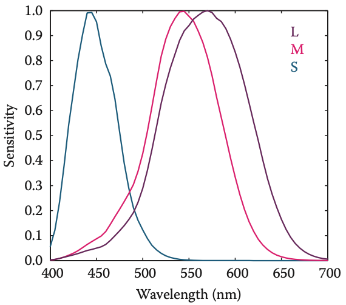
]

---

## Метамерия

__Метамерия__ — это явление, при котором разные по спектральному составу цветовые стимулы создают одинаковый отклик в клетках (одинаковое восприятие).

- Поскольку значения тристимула получаются путем интегрирования произведения двух функций, очевидно, что зрительная система человека не работает детектор волн определенной длины.

- Фактически человеческие фоторецепторы работают как линейные интеграторы излучения.

- Как следствие, интегрирование разных спектральных кривых может приводить к одинаковым значениям тристимулов.

---

## Метамерия

.left-40[
Справа на рисунке показано две кривых спектральной яркости $\Phi_1(\lambda)$ и $\Phi_2(\lambda)$, которые после интегрирования будут давать одинаковый отклик $(L, M,S)$.

__Метамерия__ являеется ключевым свойством зрения, которое позволяет создавать цветовоспроизводящие устройства.
]

.right-60[

]

---

## Метамерия

Классический эксперимент, который использует явление метамерии.

- Пусть есть 3 источника света, каждый с регулятором интенсивности.

- Есть четвертый источник света, который необходимо подобрать.

__Закон аддитивности__ Грассманна говорит о том, что, регулируя интенсивность каждого источника, можно добиться такого эффекта, что спектр, образованный смешением этих цветов, в результате интегрирования будет давать значения тристимулов, которые идентичны отклику на четвертый, неизвестный по составу источник освещения.

> При этом полученный спектр практически достоверно будет отличаться от подбираемого.

---

## Стандартный наблюдатель

.left-40[
__CIE Standard Observer__

Путем смешивания излучения трех монохроматических базовых цветов с длиной волны 435.8, 546.1, и 700 нм соответственно, получены стандартные функции отклика $\overline r(\lambda)$, $\overline g(\lambda)$ и $\overline b(\lambda)$
]

.right-60[
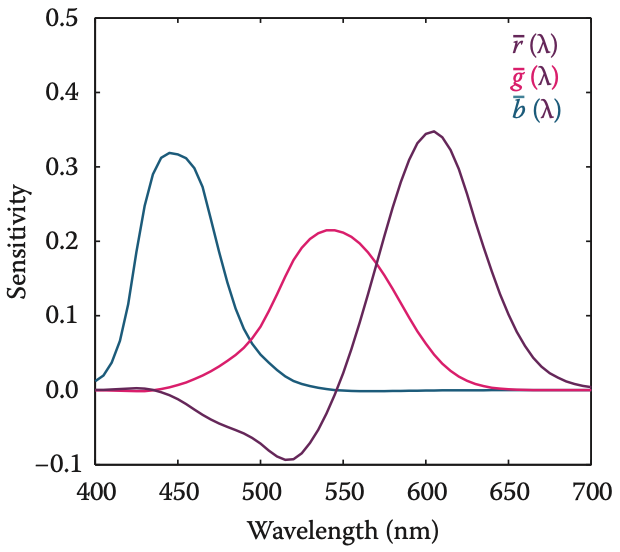
]

---

## Стандартный наблюдатель

Эксперимент по получению стандартных функций отклика строился следующим образом:

1. Респонденту демонстрировался круглый экран диаметром 2 градуса, разделенный пополам: в одной половине демонстрировался тестовый монохроматический свет. В другой половине респондент имел возможность регулировать яркость трех основных цветов, пока не будет достигнуто визуальное соответствие.

2. Выяснилось, что не все цвета могут быть сопоставлены таким образом. В этом случае респондент имел возможность добавить один из основных цветов к тестовому цвету, и далее уже добиться соответствия регулировкой оставшихся двух. Количество добавленноо цвета засчитывалось как _отрицательное_ значение яркости.

---

## Стандартный наблюдатель

Функции соответствия $\overline r(\lambda)$, $\overline g(\lambda)$ и $\overline b(\lambda)$ позволяют установить факт совпадения цветов путем сравнения тристимулов, полученных в результате интегрирования с их применением:

$$R = \int_{\lambda} \Phi_1(\lambda)~\overline r(\lambda)~d\lambda = \int_{\lambda} \Phi_2(\lambda)~\overline r(\lambda)~d\lambda,\\
G = \int_{\lambda} \Phi_1(\lambda)~\overline g(\lambda)~d\lambda = \int_{\lambda} \Phi_2(\lambda)~\overline g(\lambda)~d\lambda,\\
B = \int_{\lambda} \Phi_1(\lambda)~\overline b(\lambda)~d\lambda = \int_{\lambda} \Phi_2(\lambda)~\overline b(\lambda)~d\lambda.$$

Благодаря использованию этих функций появляется возможность компактным образом описывать цвета.

---

## История XYZ

На момент появления в 1930-е гг система тристимулов RGB была не очень востребована по двум причинам:

1. Численное интегрирование вызывало затруднения, особенно для случая когда функция может принимать отрицательные значения.

2. CIE ранее разработала функцию относительно спектральной эффективности $V(\lambda)$, которая показывала чувствительность среднего человеческого глаза к разным длинам волн. Была необходимость использования этой величины в качестве одного из тристимулов.

---

## История XYZ

.pull-left[
Для того чтобы получить систему _положительных_ функций соответствия, необходимо выбрать систему воображаемых основных цветов — __CIE 1931 Standard Observer__.

Следствием этого является то, что для воспроизведения любого цвета из видимого спектра необходимы источники освещения, которые физически не могут быть реализованы.
]

.pull-right[
Такие функции соответствия получили названия $\overline x(\lambda)$, $\overline y(\lambda)$ и $\overline z(\lambda)$, где $\overline y(\lambda) = V(\lambda)$:

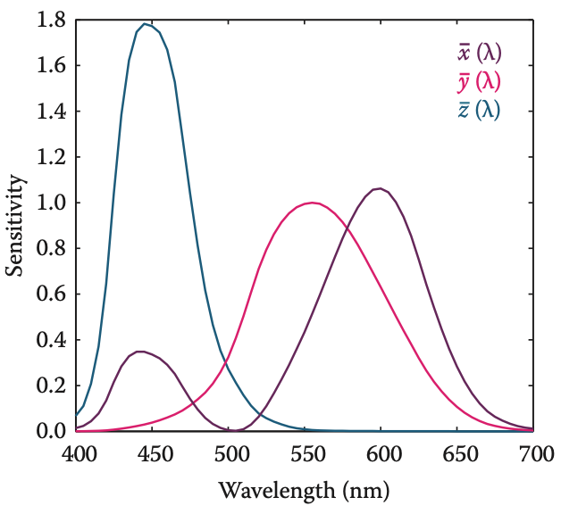
]

---

## История XYZ

Тристимулы, вычисляемые таким образом, получили названия $X$, $Y$, $Z$ во избежание путаницы с $R$, $G$ и $B$, которые ассоциированы с реально существующими базовыми цветами.

Конвертация между пространствами выполняется с помощью простого преобразования:

$$
\begin{bmatrix}
X \\
Y \\
Z
\end{bmatrix}
= \frac{1}{0.176\,97}
\begin{bmatrix}
0.490\,00 & 0.310\,00 & 0.200\,00 \\
0.176\,97 & 0.812\,40 & 0.010\,63 \\
0.000\,00 & 0.010\,00 & 0.990\,00
\end{bmatrix}
\begin{bmatrix}
R \\
G \\
B
\end{bmatrix}
$$
Поскольку пространство $XYZ$ является стандартным для перехода между другими пространствами, обычно для вычисления соответствующих тристимулов выполняется непосредственное интегрирования с помощью функций соответствия $\overline x(\lambda)$, $\overline y(\lambda)$ и $\overline z(\lambda)$, а не в $RGB$

---

## Хроматические координаты

Каждый цвет может быть представлен значениями тристимулов $(X, Y, Z)$, которые определяют трехмерное _цветовое пространство_ и занимают некоторый объем в нем, называемый _цветовой гаммой_.

Поскольку визуализация цвета в 3D затруднительна для восприятия, обычно выполняют проецирование координат на двумерную плоскость. Проекция называется _хроматической диаграммой_ и определяется следующими преобразованиями:

$$
x = \frac{X}{X + Y + Z},~y = \frac{Y}{X + Y + Z},~z = \frac{Z}{X + Y + Z}
$$

Поскольку $x + y + z = 1$, значение $z = 1 - x - y$ явяляется избыточным и появляется возможность отобразить проецированные значения цвета в системе координат $xy$.

---

## Хроматические координаты

.pull-left[
Традиционно значения самих тристимулов восстанавливаются по величине $Y$ в сочетании с хроматическими координатами:

$$X = Y\frac{x}{y}, \\
Z = Y\frac{1-x-y}{y}.$$

> Фиолетовая линия получена путем смешения коротко- и длинноволнового стимула
]

.pull-right[
Монохроматические цвета образуют копытообразную кривую, которая называется __спектральным локусом__:

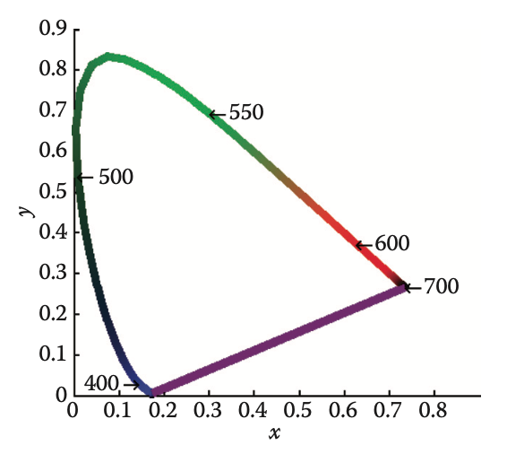
]

---

## Цветовой охват

.pull-left[
Каждому основному цвету соответствуют значения тристимулов, полученные интегрированием по всем видимому спектру, и соответственно координаты $(x, y)$ на хроматической диаграмме.

Повторив эту процедуру для каждого из основных цветов _устройства_, можно получить серию точек, определяющих цветовой охват, доступный для получения путем смешения этих цветов на нём.
]

.pull-right[
__Цветовой охват__ для CIE RGB (сплошная линия) и типичного устройства HDTV (пунктирная линия):
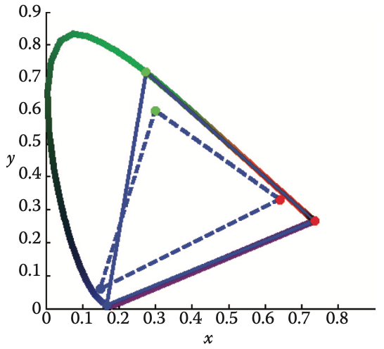
]

---

## Ограничения хроматической диаграммы

Хроматическая диаграмма обладает особенностями, которые необходимо принимать во внимание при ее использовании:

- Каждая система воспроизводства цвета обладает своими основным цветами, которые не являются идеально монохроматическими.

- Функции соответствия CIE не эквивлентны функциям чувствительности колбочек, поэтому расстояние между цветами на хроматической диаграмме не является надежным показателем визуального отличия цветов.

Для частичной компенсации проблемы второго типа CIE разработала хроматическую диаграмму CIE u'v'

---

## Хроматическая диаграмма CIE u'v'

.pull-left[
Хроматическая диаграмма CIE u'v' обеспечивает более равномерное распределение цветов благодаря применению проекции следующего типа:

$$u' = \frac{4X}{X + 15Y + 3Z},\\
v' = \frac{9Y}{x + 15Y + 3Z}$$
]

.pull-right[

]

---

## Проблемы XYZ

- Основные цвета в системе XYZ — воображаемые.  Невозможно построить устройство, которое будет иметь три источника освещения (положительного), которое сможет воспроизводить все цвета видимой части спектра.

- Помимо этого, существует большое число возможных сочетаний XYZ, которые не соответствуют ни одному физическому цвету.

- Теоретически не невозможно построить воспринимающее устройство, чьи основные цвета будут близки к функциям соответствия XYZ, однако такое решение не практично как по стоимости аппаратного обеспечения, так и по сложности программной обработки.

В идеале цветовое пространство должно быть: физически реализуемым, эффективно кодируемым, перцептивно равномерным и интуитивно параметризуемым.

---

## Проблемы XYZ

- XYZ по-прежнему активно используется, главным образом как независимое от устройства цветовое пространство.

- Остальные цветовые пространства определяются по их отношению к XYZ

---

## Переход RGB-XYZ

Поскольку цветовое пространство RGB зависит от параметров источников красного, зеленого и синего цвета конкретного монитора, для точного перехода в XYZ необходимо производить калибровку — измерение параметров.

1. Поочередно измеряется спектр сигналов, которые соответствуют цветовым векторам $R = (1, 0, 0)$, $G = (0, 1, 0)$ и $B = (0, 0, 1)$.
2. На основе спектрометрирования получаются хроматические координаты $(x_R, y_R)$, $(x_G, y_G)$, $(x_B, y_B)$.
3. Аналогичное спектрометрирование посторяется для _точки белого_ $W = (1, 1, 1)$, чтобы получить ее хроматические координаты $(x_W, y_W)$.

Полученные хроматические координаты характеризуют дисплей и позволяют сформировать матрицу трансформации между его цветовым пространством и CIE XYZ.

---

## Переход RGB-XYZ

Для построения матрицы трансфо
рмации после получения хроматических координат выполняется следующее преобразование:

1. Используя зависимость $z = 1 - x - y$, получают триплеты $(x_R, y_R, z_R)$, $(x_G, y_G, z_G)$, $(x_B, y_B, z_B)$, $(x_W, y_W, z_W)$.

2. Измеряется максимальная яркость монитора $\max(Y) = Y_W$.

3. Используя соотношения $X = Y\frac{x}{y},~Z = Y\frac{1-x-y}{y}$, получают соответствующие значения тристимулов $(X_W, Y_W, Z_W)$.

4. Составляется система линейных уравнений относительно $S_R, S_G, S_B$:

$$\begin{eqnarray}
X_W &=& x_R S_R + x_G S_G + x_B S_B, \\
Y_W &=& y_R S_R + y_G S_G + y_B S_B, \\
Z_W &=& z_R S_R + z_G S_G + z_B S_B,
\end{eqnarray}$$

---

## Переход RGB-XYZ

$$\begin{eqnarray}
X_W &=& x_R S_R + x_G S_G + x_B S_B, \\
Y_W &=& y_R S_R + y_G S_G + y_B S_B, \\
Z_W &=& z_R S_R + z_G S_G + z_B S_B,
\end{eqnarray}$$

Решив систему линейных уравнений, получаем матрицу преобразования:

$$
\begin{bmatrix}
X \\
Y \\
Z
\end{bmatrix}
=
\begin{bmatrix}
x_R S_R & x_G S_G & x_B S_B \\
y_R S_R & y_G S_G & y_B S_B \\
z_R S_R & z_G S_G & z_B S_B
\end{bmatrix}
\begin{bmatrix}
R \\
G \\
B
\end{bmatrix}
$$

Яркость каждого цвета монитора может быть определена как

$$Y = y_R S_R R + y_G S_G G + y_B S_B B$$
---

## Использование sRGB

Если вы используете изображение, для которого основные цвета не известны (не была выполнена калибровка), обычно предполагают, что оно создано на устройстве с цветовым пространством _sRGB_, которое соответствует вещанию в формате HDTV.

Стандарт __ITU-R BT.709__ предписывает следующие величины хроматических координат:

|   | R      | G      | B      | W      |
|---|--------|--------|--------|--------|
| x | 0.6400 | 0.3000 | 0.1500 | 0.3127 |
| y | 0.3300 | 0.6000 | 0.0600 | 0.3290 |

---

## Нелинейные преобразования цвета

Перед/после трансформации в XYZ обычно также применяется нелинейная трансформация с целью минимизировать перцептивные ошибки восприятия, связанные с квантификацией цвета. Общий вид таких преобразований таков:

$$C_\mathrm{nonlinear}=\begin{cases}
sC, & C \le t\\
(1+f)C^{\gamma}-f, & C > t
\end{cases}$$

Где $C = R, G, B$. Параметры $s, f, t, \gamma$, а также непосредственные спектры основных цветов и точки белого определяют цветовое пространство.

В частности, для sRGB:

$$C_\mathrm{srgb}=\begin{cases}
12.92C, & C \le 0.0031308\\
1.055C^{1/2.4}-0.055, & C > 0.0031308
\end{cases}$$

---

## Распространенные преобразования

.small[_Pascale, 2003_]

---

## Цвето-оппонирующие пространства

В цвето-оппонирующих пространствах используется один ахроматический канал (яркость) и два канала, предсттавляющих оппонирующие (несовместимые) цвета в отрицательном и положительном направлении.

- Распространенные оппонирующие каналы: красный—зеленый и желтый—синий.
- Наиболее известна цвето-оппонирующая система — это  CIE 1976 $L^*a^*b^*$, известная как просто CIELAB.
- СIELAB характеризуется более-менее равномерным изменением цвета с точки зрения восприятия, и может быть использовано для вычисления разности цветов.
- CIELAB является _рудиментарным_ цветовым пространством, поскольку учитывает не только значения тристимулов $X, Y, Z$, но также значения тристимулов $X_n, Y_n, Z_n$, которые соответствуют диффузному отражению света известного источника освещения от белой поверхности.

---

## CIE LAB

Канал $L^* \in [0, 100]$ обозначает _светлоту_ цвета, т.е. воспринимаемое отражение цвета с тристимулом $X, Y, Z$. Компоненты $a^*, b^* \in [-128, 128]$ являются оппонирующими хроматическими.

Преобразование задается как:

Где функция $f$ определена как:

$$f(t) = \begin{cases}
  \sqrt[3]t & \text{если } t > 0.008856 \\
  7.787 r + \frac{16}{116} & \text{в противном случае}
\end{cases}$$

---

## Разность цветов в CIE LAB

Поскольку данное пространство перцептивно примерно линейно, можно оценить разность цветов, сконвертировав их в CIELAB, а затем вычислив Евклидово расстояние между ними.

Используется следующая широко применяемая формула:

$$\Delta E^*_{ab} = \sqrt{(\Delta L^*)^2 + (\Delta a^*)^2 + (\Delta b^*)^2}$$

---

## Обратное преобразование

Для перехода из CIELAB в XYZ используется обратное преобразование следующего вида:

$$\begin{align}
X &= X_{\mathrm{n}} f^{-1}\left(\frac{L^\star+16}{116} + \frac{a^\star}{500}\right)\\
  Y &= Y_{\mathrm{n}} f^{-1}\left(\frac{L^\star+16}{116}\right),\\
  Z &= Z_{\mathrm{n}} f^{-1}\left(\frac{L^\star+16}{116} - \frac{b^\star}{200}\right),\\
\end{align}$$

где $\delta = 6/29$ и

$$f^{-1}(t) = \begin{cases}
  t^3 & \text{если } t > \delta \\
  3\delta^2\left(t - \frac{4}{29}\right) & \text{в противном случае}
\end{cases}$$

---

## Цветовое пространство HCL

Цветовое пространство HCL (Hue — Chroma — Luminance) является полярным преобразованием однородного цветового пространства CIELUV и образует искаженный двойной конус, где каждое из трех измерений непосредственно контролирует одно из трех основных перцептивных измерений.

$$H = \texttt{atan2}(u, v), C = \sqrt{u^2 + v^2}, L = L$$
Связь с пространством RGB осуществляется через последовательность:

$$\texttt{RGB} \to \texttt{XYZ} \to \texttt{CIELUV} \to \texttt{HCL}$$

_Achim Zeileis, Kurt Hornik, Paul Murrell_ (2009). “Escaping RGBland: Selecting Colors for Statistical Graphics.” __Computational Statistics & Data Analysis__, 53(9), 3259-3270.

---

## Цветовое пространство HCL

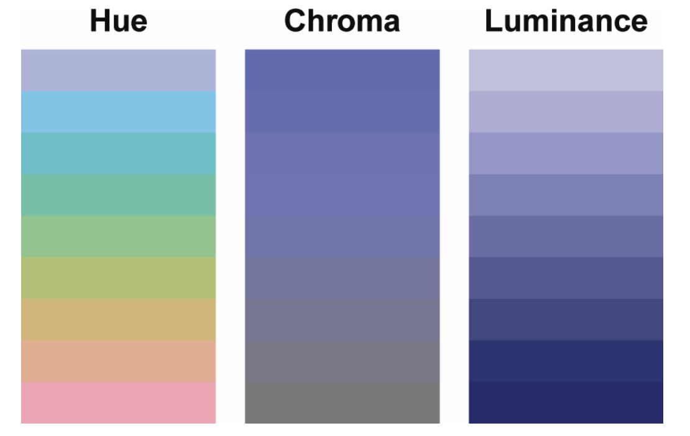

_Reto Stauffer, Georg J. Mayr, Markus Dabernig, Achim Zeileis_ (2015). “Somewhere over the Rainbow: How to Make Effective Use of Colors in Meteorological Visualizations.” __Bulletin of the American Meteorological Society__, 96(2), 203-216.

---

## Цветовое пространство HCL

---

## Цветовое пространство HCL

Категориальные шкалы

---

## Цветовое пространство HCL

Последовательные шкалы

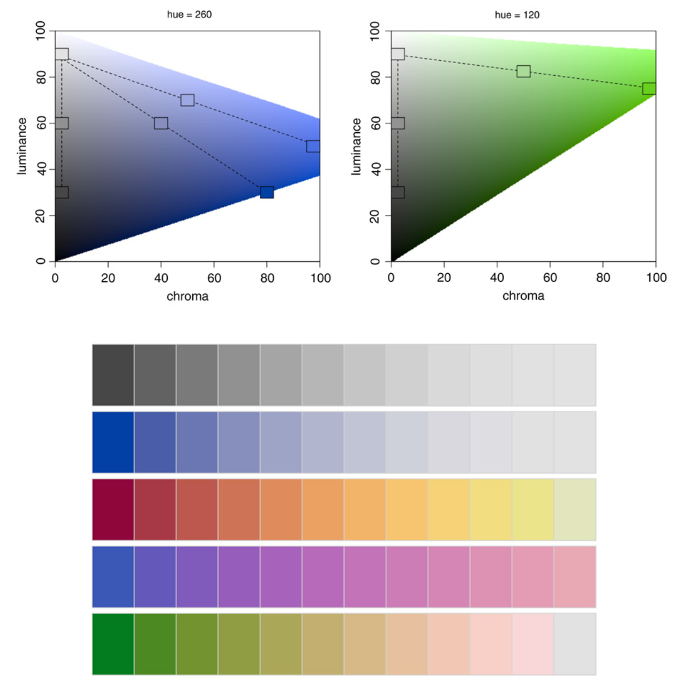

---

## Цветовое пространство HCL

Расходящиеся шкалы

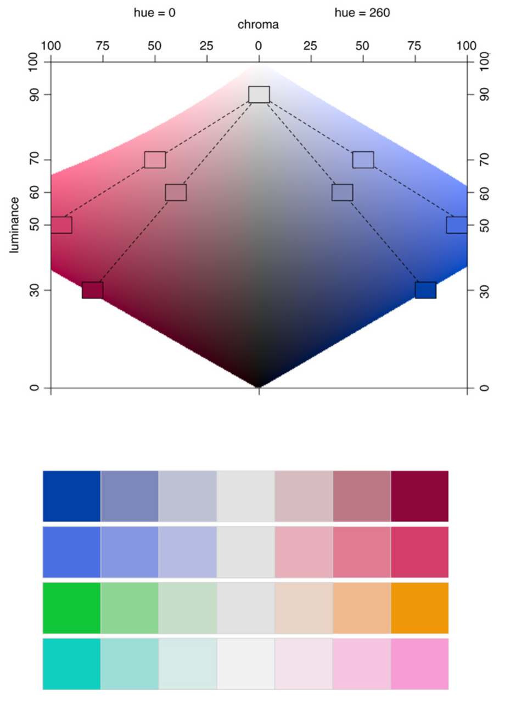

---

## Цветовое пространство HCL

---

## Цветовое пространство HCL

---

## Цветовое пространство HCL

---

## Цветовое пространство HCL

---

## Пространство Манселла

.pull-left[
Цветовое пространство __Манселла__ ограничено объемом асимметричной формы.

- _Желтые_ оттенки высокой хромы (насыщенности) обладают высокой светлотой.

- _Сине-фиолетовые_ оттенки высокой хромы (насыщенности) обладают низкой светлотой.
]
.pull-right[
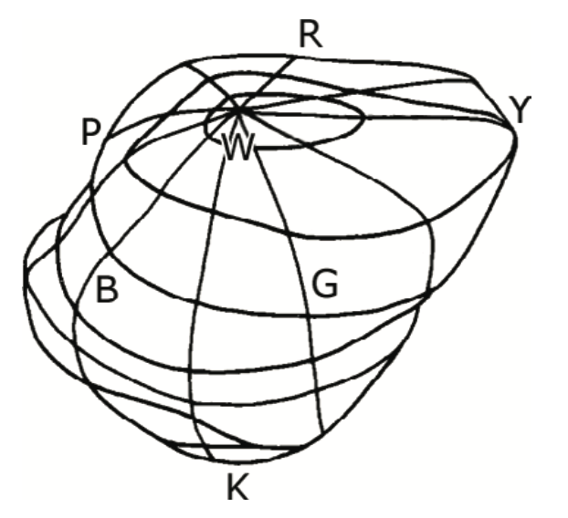
]

.blue[Различные области цветового пространства имеют разный максимум хромы.]

---

## Пространство Манселла

.left-60[

- Светлота по вертикальной оси варьируется от 0 (черный) до 10 (белый), образуя таким образом 10 кругов.
- Каждый горизонтальный круг разделен на пять основных тонов: красный (Red), желтый (Yellow), зеленый (Green), голубой (Blue) и фиолетовый (Purple).

  - Между основными тонами располагаются 5 переходных.
  - Полученные 10 ступеней разделяются на 10 подступеней с номерами от 1 до 100.
]

.right-40[
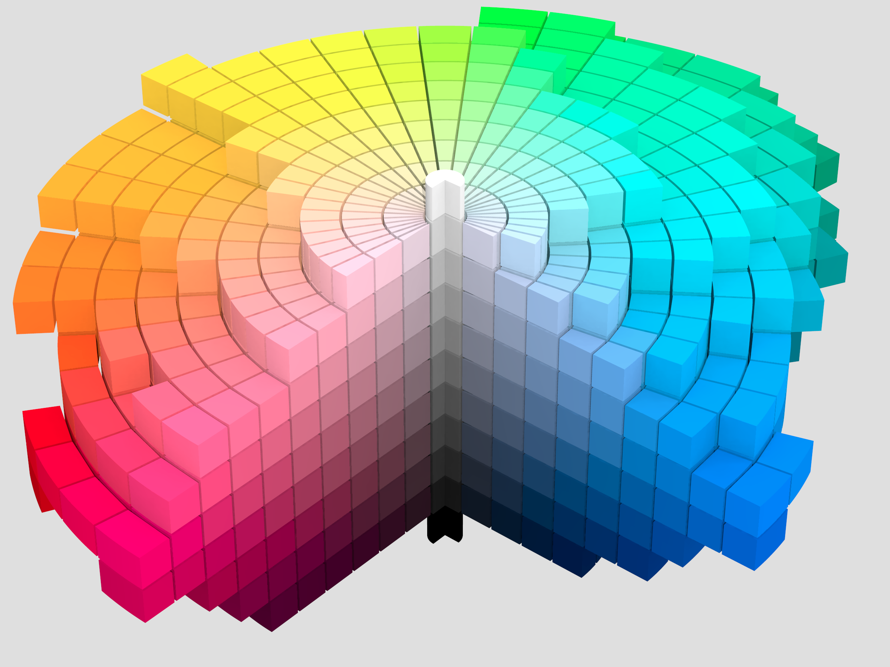
На практике шкалы часто составляются для 40 ступеней с шагом 2.5
]

---

## Шкалы в пространстве Манселла

Пространство Манселла удобно тем, что в ней можно легко получить готовую цветовую шкалу, проведя систематический путь из одной точки в другую (Brewer, 2015):

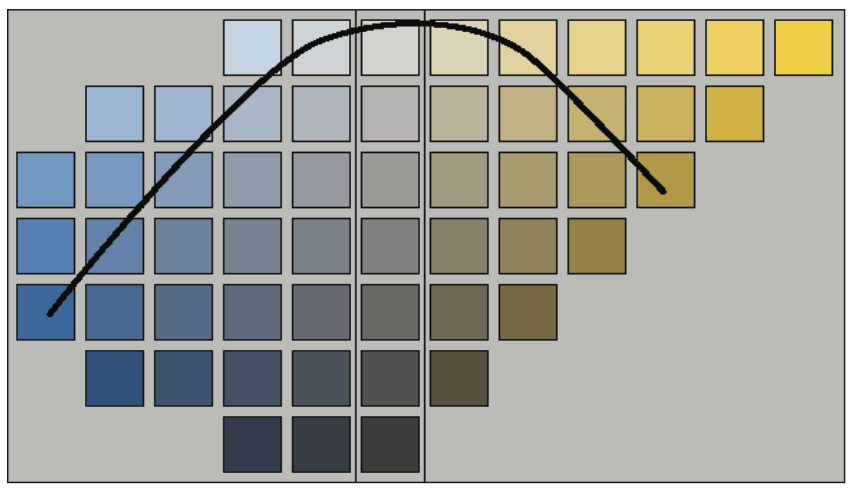

---

## Хроматическая адаптация

Среда, в которой происходит наблюдение объектов, оказывает огромное влияние на восприятие цвета.

Разнообразие источников освещения велико: дневной свет, лунный свет, свет флюоресентной лампы, свет открытого огня (свечи).

Различия проявляются по двум параметрам:

- Интенсивность испускаемого света.
- Спектральный состав света.

> Зрительная система человека учитывает эти изменения посредством процесса, который носит название __адаптации__.

---

## Хроматическая адаптация

Выделяют три типа адаптации:

- Световая адаптация (переход из темной среды в светлую). Занимает несколько минут.
- Темновая адаптация (переход из светлой среды в темную). Занимает несколько часов.
- Хроматическая адаптация (переход из одного источника освещения под другой).

Хроматическая адаптация аналогична установке точки белого в графических пакетах.

Наличие способности к хроматической адаптации является причиной _цветопостоянства_ — восприятие отраженного от объекта цвета не зваисит от условий освещения.

---

## Хроматическая адаптация

Зеленые фрагменты имеют одинаковый цвет, но находятся в разных условиях освещения.

---

## Хроматическая адаптация

.pull-left[

]

.pull-right[
Белый лист бумаги, освещенный такими источниками освещения, будет восприниматься именно как белый.
]

---

## Хроматическая адаптация

Вычислительные модели хроматической адаптации фокусируются на механизме возбуждения колбочек.

Простейшая модель _фон Криса_ предполагает, что каждый тип клетки адаптируется к спектру освещения независимо. В этом случае каждая из тристимулов масштабируется на свой коэффициент:

$$
L_a = \alpha L,\\
M_a = \beta M,\\
S_a = \gamma S,
$$

где $(L_a, M_a, S_a)$ — хроматически адаптированные сигналы колбочек, $\alpha$, $\beta$, $\gamma$ — независимые котнтроллеры отклика.

---

## Хроматическая адаптация

Модель фон Риса приводит к подобному масштабированию функций отклика клеток:

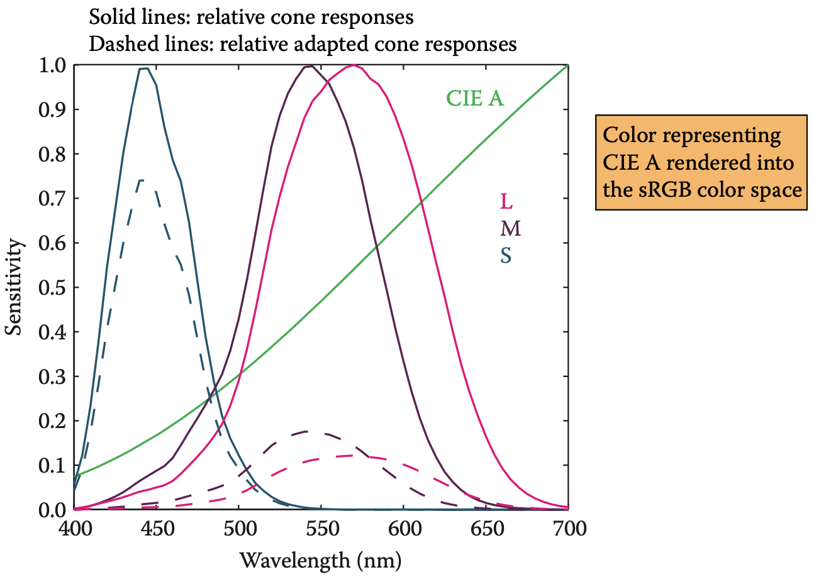

---

## Хроматическая адаптация

При вычислении модели адаптации важно понимать, какими характеристиками обладает источник освещения.

При цифровой обработке изображений за характеристику источника освещения часто принимают сигнал, который формирует максимальное значение тристимула $(L_w, M_w, S_w)$. В этом случае адаптация фон Криса реализуется путем масштабирования на обратную матрицу измеренных компонент:

---

## Хроматическая адаптация

Часто возникает такая задача: какой стимул должен быть сгенерирован при одном освещении, чтобы его цветовое восприятие соответствовало восприятию другого стимула, наблюдаемого при другом освещении?

Задача решается путем касакадирования аналогичных преобразований при условии, что измерены два источника освещения $(L_{w_1}, M_{w_1}, S_{w_1})$ и $(L_{w_2}, M_{w_2}, S_{w_2})$:

---

## Хроматическая адаптация

При использовании хроматической адаптации нет необходимости перерасчета визуализируемой сцены. Коррекция на условия освещения делается после выполнения рендеринга.

Во избежание артефактов вычисления должны производиться с плавающей точкой. И только перед отображением конвертироваться в 8-битное изображение.