## Направления учебного курса

Теория и практика:

1. Компьютерная графика как инструмент визуализации пространственных данных.
2. Факторы и методы визуализации пространственных данных.
3. Алгоритмы визуализации пространственных данных.
4. Языки представления графических стилей (QML, SLD, YSLD)

Технологии:

1. API PyQGIS и Geometric Expressions для построения картографических изображений.
2. Совершенствование навыков программирования на Python.

---

## Компьютерная графика

Наука и искусство визуальной коммуникации посредством компьютерного дисплея и инструментом интерактивного взаимодействия с ним.

- Визуальный аспект: компьютер -> человек
- Интерактивный аспект: человек -> компьютер


---

## Мультидисциплинарность

- физика

- математика

- человеческое зрение

- человеко-машинное взимодействие

- программная и аппаратная инженерия

- графический дизайн

- ...

---

## Связь с компьютерным зрением

__Компьютерная графика__: реализация с определенного ракурса внешнего вида сцены, в которую погружены модели объектов под заданными условиями освещения.

__Компьютерное зрение__: определение параметров сцены и погруженных в нее объектов при заданных допущениях.

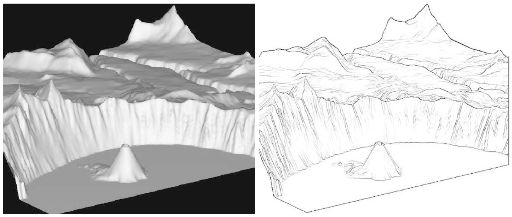

.small[_Lesage, Visvalingam, 2002_]

---

## Графический конвейер

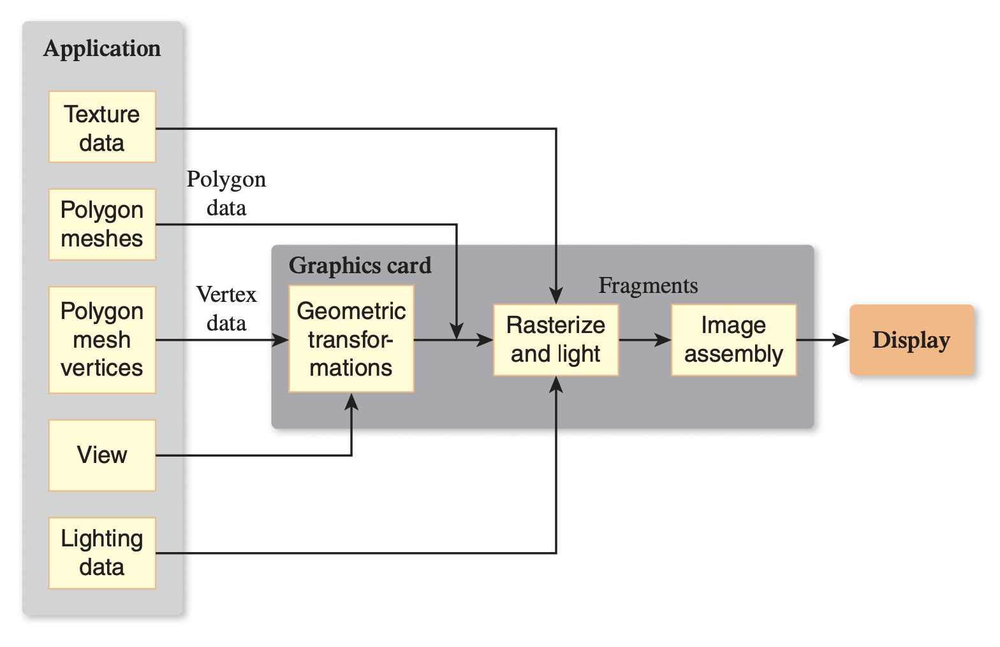

.small[_Hughes et al, 2013_]

---

## Графический конвейер

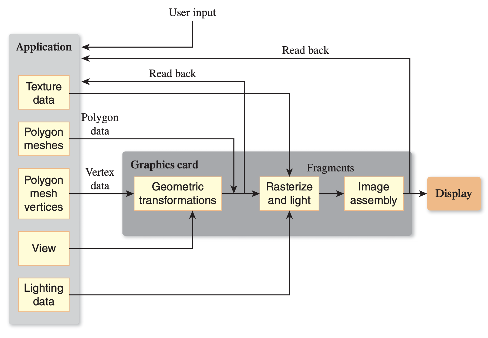

Взаимодействие с пользователем может оказывать влияние на последующее поведение графического приложения

---

## Графический конвейер 2D-приложения

.pull-left[
  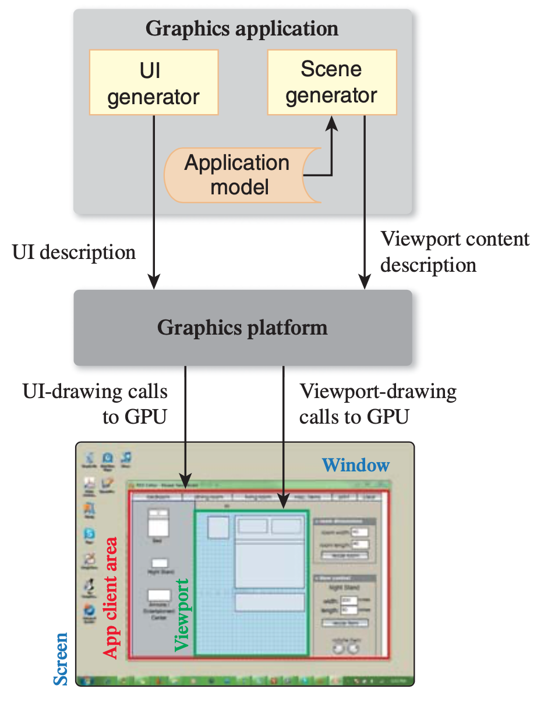
]

.pull-right[
__Графическая платформа__ отвечает за взаимодействие приложения и оборудования

__Модель приложения__ (application model) представляет визуализируемые данные

__Клиентская область__ (client area) определяет пространство, в котором приложение выполняет отрисовку.

__Порт просмотра__ (viewport) определяет часть клиентской области, где генератор сцены выполняет отрисовку модели
]

---

## Эволюция графической платформы

__1980-е — начало 1990-х__ _(Apple QuickDraw, Microsoft GDI)_: отрисовка пикселей на прямоугольной канве в целочисленных координатах. Отрисовка .red[_примитивов_]: геометрических форм или битмапов (пиксельных карт).

  - Точка $(0,0)$ располагается в левом верхнем углу.
  - Каждый примитив заполняется путем вызова определенной функции (например, `FillRectangle`).
  - Размер объекта зависит от разрешения объекта. Более низкое разрешение (крупные пикселы) — больше размеры объектов.

__Середина 1990-х — н.вр.__ Переход к координатам с плавающей точкой позволил решить проблему зависимости размера изображения от системы координат.

---

## Непосредственный режим

В .blue[__непосредственном режиме__] _(immediate mode)_ клиент через графическую платформу обращается непосредственно к выводящему устройству.

- Запись примитивов, переданных приложением, не выполняется.
- При смене сцены приложение должно перерисовать ее целиком.

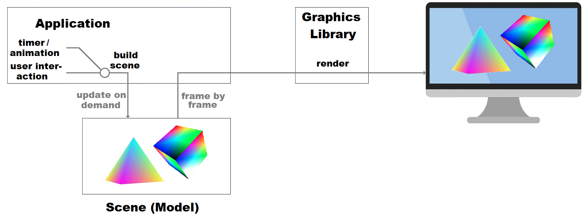

---

## Сохраненный режим

В .red[__сохраненном режиме__] _(retained mode)_ графическая платформа хранит спецификацию сцены в виде специализированной базы данных, которая называется графом сцены _(scene graph)_.

- Объекты могут добавляться в граф сцены последовательно.
- Каждое изменение графа приводит к перерисовке сцены

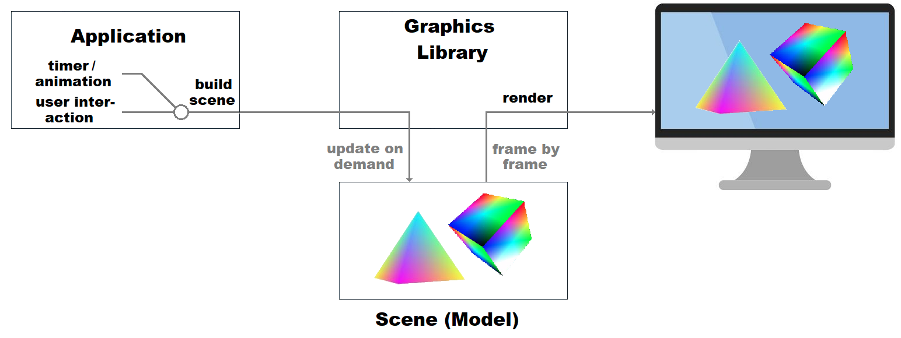

---

## Процедурный и декларативный подходы

.blue[__Процедурный код__] пишется на императивном языке программирования

- Описывает _действия_
- Стандарт при взаимодействии с графической платформой
- В геоинформационных пакетах применяется на низком уровне, невидимом для пользователя

.red[__Декларативные спецификации__] фиксируются на языке разметки

- Описывают _результаты_
- Вспомогательное средство в графических платформах
- В геоинформационных пакетах применяется на высоком уровне при описании стилей карт (CSS, LYR, QML, SLD, YSLD)

---

## Векторная модель данных

__Simple Features__ (официально _Simple Features Access_) --- это стандарт Open Geospatial Consortium (OGC) и Международной организации стандартизации (ISO) ISO 19125, который определяет общую модель хранения и доступа к векторным объектам (точка, линия, многоугольник, мульти точечные, мультилинии и т. д.), в географических информационных системах:

<http://www.opengeospatial.org/standards/sfa>

- Пространственный объект (_feature_) состоит из геометрии (_geometry_) и атрибутов геометрии (_attributes_).

- Примеры объектов: здание, река, административная граница, метеостанция.

---

## Simple Features

Все геометрии состоят из точек. Точки являются координатами в 2-, 3- или 4-мерном пространстве. Все точки в геометрии имеют одинаковую размерность. В дополнение к координатам $X$ и $Y$ имеются два дополнительных дополнительных параметра:

- координата $Z$, обозначающая высоту
- координата $M$, обозначающая некоторую меру, связанную с точкой, а не с признаком в целом (в этом случае это будет атрибут объекта).

__Четыре__ варианта геометрии:

- двумерные точки $XY$
- трехмерные точки $XYZ$
- трехмерные точки $XYM$
- четырехмерные точки $XYZM$

В случае использования широт и долгот X соответствует долготе.

---

## Simple Features

Всего стандарт __Simple Features__ включает в себя 17 типов геометрий. Из них наиболее употребительными являются следующие:

__Односвязные__ объекты

Тип |	Описание
----|---------
`POINT`	| нуль-мерная геометрия, содержащая одну точку
`LINESTRING` | последовательность точек, соединенных прямыми, несамопересекающимися отрезками; одномерная геометрия
`POLYGON`	| геометрия с положительной площадью (двумерная); последовательность точек, отрезки между которыми формируют замкнутое кольцо без самопересечений; первое кольцо является внешним, ноль и более остальных колец представляют дырки внутри полигона

---

## Simple Features

__Многосвязные__ объекты

Тип |	Описание
----|---------
`MULTIPOINT` | множество точек; геометрия типа `MULTIPOINT` называется _простой_ если ни одна пара точек в `MULTIPOINT` не совпадает
`MULTILINESTRING`	| множество линий
`MULTIPOLYGON`	| множество полигонов
`GEOMETRYCOLLECTION`	| множество геометрий произвольного типа за исключением `GEOMETRYCOLLECTION`

Оставшиеся виды геометрий _Simple Features_ включают: `CIRCULARSTRING, COMPOUNDCURVE, CURVEPOLYGON, MULTICURVE, MULTISURFACE, CURVE, SURFACE, POLYHEDRALSURFACE, TIN, TRIANGLE`

---

## Simple Features

```{r, echo=FALSE,fig.width=16, fig.height=8, fig.show='hold'}
library(sf)

p = st_point(c(3.2,4))

pp = rbind(c(3.2,4), c(3,4.6), c(3.8,4.4), c(3.5,3.8), c(3.4,3.6), c(3.9,4.5))
mp = st_multipoint(pp)

s1 = rbind(c(0,3),c(0,4),c(1,5),c(2,5))
ls = st_linestring(s1)

s2 = rbind(c(0.2,3), c(0.2,4), c(1,4.8), c(2,4.8))
s3 = rbind(c(0,4.4), c(0.6,5))
mls = st_multilinestring(list(s1,s2,s3))

p1 = rbind(c(0,0), c(1,0), c(3,2), c(2,4), c(1,4), c(0,0))
p2 = rbind(c(1,1), c(1,2), c(2,2), c(1,1))
pol = st_polygon(list(p1, p2))
p3 = rbind(c(3,0), c(4,0), c(4,1), c(3,1), c(3,0))
p4 = rbind(c(3.3,0.3), c(3.8,0.3), c(3.8,0.8), c(3.3,0.8), c(3.3,0.3))[5:1,]
p5 = rbind(c(3,3), c(4,2), c(4,3), c(3,3))
mpol = st_multipolygon(list(list(p1,p2), list(p3,p4), list(p5)))

gc = st_geometrycollection(list(mp, mpol, ls))

par(mfrow = c(2,3))
plot(p, cex = 5, pch = 20, main = 'POINT', cex.main=3)
plot(ls, lwd = 3, main = 'LINESTRING', cex.main=3)
plot(pol, lwd = 3, col = 'grey', main = 'POLYGON', cex.main=3)
plot(mp, cex = 5, pch = 20, main = 'MULTIPOINT', cex.main=3)
plot(mls, lwd = 3, main = 'MULTILINESTRING', cex.main=3)
plot(mpol, lwd = 3, col = 'grey', main = 'MULTIPOLYGON', cex.main=3)
par(mfrow = c(1,1))
```

---

## Simple Features

```{r, echo=FALSE,fig.width=16, fig.height=8, fig.show='hold'}
plot(gc, lwd = 3, col = 'grey', border = 'black', main = 'GEOMETRYCOLLECTION', cex.main=3)
```

---

## Текстовое представление

__Well-Known Text (WKT)__ --- стандарт представления геометрии в виде множества списков координат, в которых координаты вершин разделены пробелами, вершины разделены запятыми, а компоненты полигонов и мультигеометрий заключены в круглые скобки и также разделены запятыми:

```{r, echo=FALSE, collapse=T}
cat(st_as_text(p))
cat(' ')
cat(st_as_text(ls))
cat(' ')
cat(st_as_text(pol))
cat(' ')
cat(st_as_text(mp))
cat(' ')
cat(st_as_text(mls))
cat(' ')
cat(st_as_text(mpol))
cat(' ')
cat(st_as_text(gc))
```

---

## Бинарное представление

__Well-Known Binary (WKB)__ --- бинарный формат хранения координат.

- Именно этот формат фактически используется в базах данных, поскольку он обеспечивает высокую скорость чтения и записи данных (в отличие от текстового).

- Внешний вид данных в формате WKB мало о чем говорит человеку, поскольку он предназначен для чтения компьютером.

Например, строка `LINESTRING` будет выглядеть так:

```{r, echo=FALSE}
cat(st_as_binary(ls))
```

---

## Программное представление

При программном чтении пространственных данных геометрия представляется в виде списка из матриц координат.


```{r, echo=FALSE, collapse=T}
cat(st_as_text(pol))
print(pol[[1]])
print(pol[[2]])
```

> Каждая матрица соответствует круглым скобкам самого глубокого уровня вложенности. Для каждого типа данных количество уровней строго определено.

---

## Отрисовка векторных объектов

- Две основных операции: обводка и заливка
- В случае точечных данных применяются не к самой точке, а используемой для ее отображения фигуре.

Общий алгоритм для обводки:

1. Установить тип отображаемого объекта
2. Организовать обход по всем уровням вложенности с помощью цикла
3. На самом низком уровне вложенности получить матрицу координат.
4. Последовательно соединяя соседние координаты в матрице, отрисовать границу отрезками.

---

## Отрисовка отрезков

`draw_line(x0, y0, x1, y1)`

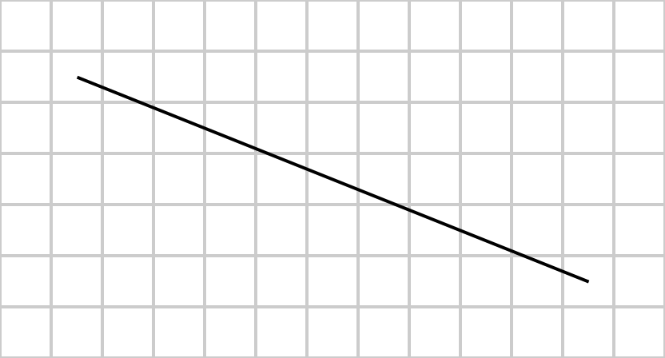

.blue[__Алгоритм Брэзенхема__]
.small[_Bresenham, J. E._ (1965). "Algorithm for computer control of a digital plotter" (PDF). __IBM Systems Journal__. 4 (1): 25–30. doi:10.1147/sj.41.0025.]

---

## Алгоритм Брезенхэма

Cистема экранных координат $XY$, где $X$ — столбец (увеличивается слева направо), $Y$ — строка (увеличивается сверху вниз)

- $(x_0, y_0)$ — начальная точка отрезка в экранных координатах
- $(x_1, y_1)$ — конечная точка отрезка в экранных координатах

Уравнение отрезка:
$$\frac{y - y_0}{y_1-y_0} = \frac{x - x_0}{x_1-x_0}$$
Выразив $y$, получаем:
$$y = \color{red}{\underbrace{\frac{y_1 - y_0}{x_1-x_0}}_{\textbf{d (уклон)}}} (x - x_0) + y_0$$
---

## Алгоритм Брезенхэма

_Стандартно_ рассматривается отрисовка линии, которая располагается в секторе `В-ЮВ`, т.е. идет относительно начальной точки вправо и полого вниз при соблюдении следующих условий:

- $x_0 \geq 0,~y_0 \geq 0$;
- $x_0 < x_1,~y_0 \leq y_1$;
- $x_1 - x_0 \geq y_1 - y_0$.

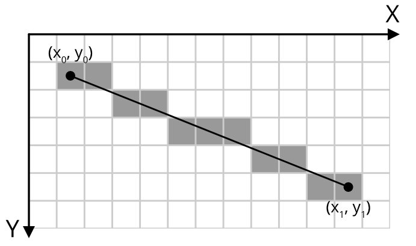

---

## Алгоритм Брезенхэма

Для сектора `В-ЮВ` алгоритм опирается на координаты $x$:

.pull-left[__Вычисляем заранее__:

- $dx = x_1 - x_0$.
- $dy = y_1 - y_0$.
- $\color{blue}{d = dy / dx}$;
- $\color{blue}{y = y_0}$;
- $e = 0$]

.pull-right[__Для $\color{blue}{x = x_0, ... x_1}$, выполняем__:

1. Рисуем пиксель $(x, y)$.
2. Обновляем ошибку $e = e + |d|$.
3. Если $e \geq 0.5$, то:
  - $\color{blue}{y = y + \texttt{sign}(dy)}$,
  - $e = e - 1$.]

Использование функции $\texttt{sign}$ позволяет применять алгоритм также и для сектора `В-СВ` (только $y$ будет уменьшаться).

Обозначим этот случай как `draw_line_byX(x0, y0, x1, y1)`

---

## Алгоритм Брезенхэма

.pull-left[_Альтернативно_ рассматривается отрисовка линии, которая располагается в секторе `Ю-ЮВ`, т.е. идет относительно начальной точки вправо и круто вниз при соблюдении следующих условий:

- $x_0 \geq 0,~y_0 \geq 0$;
- $x_0 \leq x_1,~y_0 < y_1$;
- $x_1 - x_0 < y_1 - y_0$.]

.pull-right[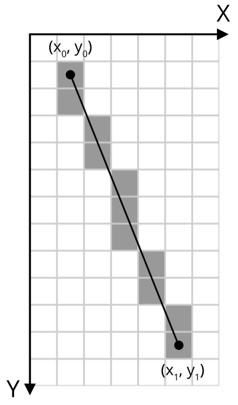]

---

## Алгоритм Брезенхэма

Для сектора `Ю-ЮВ` алгоритм опирается на координаты $y$:

.pull-left[__Вычисляем заранее__:

- $dx = x_1 - x_0$.
- $dy = y_1 - y_0$.
- $\color{red}{d = dx / dy}$;
- $\color{red}{x = x_0}$;
- $e = 0$]

.pull-right[__Для $\color{red}{y = y_0, ... y_1}$, выполняем__:

1. Рисуем пиксель $(x, y)$.
2. Обновляем ошибку $e = e + |d|$.
3. Если $e \geq 0.5$, то:
  - $\color{red}{x = x + \texttt{sign}(dx)}$,
  - $e = e - 1$.]

Использование функции $\texttt{sign}$ позволяет применять алгоритм также и для сектора `Ю-ЮЗ` (только $x$ будет уменьшаться).

Обозначим этот случай как `draw_line_byY(x0, y0, x1, y1)`

---

## Алгоритм Брезенхэма

Для оставшихся направлений построение линий реализуется путем перестановки местами начальной и конечной точки. Код результирующей функции на языке __Python__:
```{python, eval=FALSE}
def draw_line(x0, y0, x1, y1):
    if abs(y1 - y0) < abs(x1 - x0): # пологая линия
        if x0 > x1:
            draw_line_byX(x1, y1, x0, y0)
        else:
            draw_line_byX(x0, y0, x1, y1)
    else:
        if y0 > y1:                 # крутая линия
            draw_line_byY(x1, y1, x0, y0)
        else:
            draw_line_byY(x0, y0, x1, y1)
```

где `abs()` — функция вычисления модуля.

---

## Заливка полигона
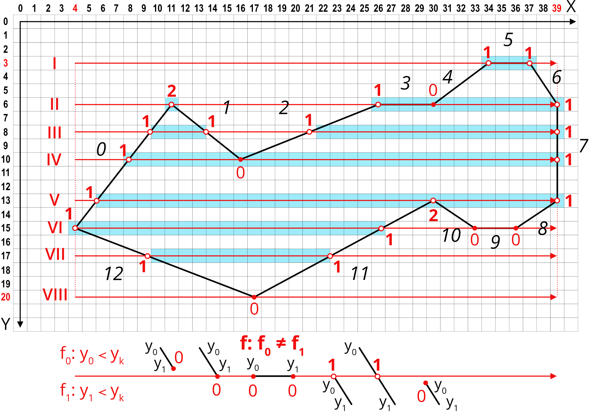

---

## Алгоритм сканирующей линии

Для каждого $y_k = y_{min},...,y_{max}$ необходимо получить упорядоченное по возрастанию множество $X = \{x_1, x_2, ..., x_n\}$ абсцисс точек его пересечения с исходными линиями:

1. Для каждой линии $l_j, j = 1,...,N$:

  - вычислить флаг пересечения $f: y^j_0 > y_k \neq y^j_1 > y_k$;
  - если $f = \texttt{TRUE}$, то
      - вычислить $x^j = x^j_0 + (x^j_1 - x^j_0)\frac{y_k - y^j_0}{y^j_1 - y^j_0}$;
      - добавить $x^j$ в множество $X$.

2. Если $X$ не пусто, то упорядочить его по возрастанию и выполнить закрашивание между его элементами в порядке:

$$\lceil x_1 \rceil \to \lfloor x_2 \rfloor,~\lceil x_3 \rceil \to \lfloor x_4 \rfloor,~...~,~\lceil x_{n-1} \rceil \to \lfloor x_n \rfloor$$

---

## Отсечение

__Отсечение (clipping)__ — одна из финальных процедур графического конвейера, которая позволяет прорисовывать только те объекты, которые попадают в поле зрения наблюдателя.

В трехмерной графике объем видимости определяется пирамидой, ограниченной шестью плоскостями обрезки (_clipping planes_). На рисунке ниже объекты Б и В будут удалены:
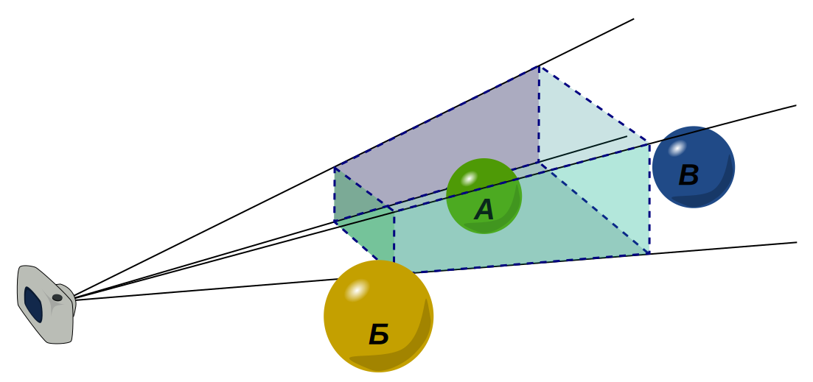
.small[https://commons.wikimedia.org/wiki/File:Frustum_clipping.svg]

---

## Двумерное отсечение

В двумерной графике, которая широко используется в ГИС, стандартно используются алгоритмы отсечения отрезков и многоугольников.

> Отсечение отрезков и многоугольников выполняется после проецирования объектов в экранную систему координат.

.pull-left[
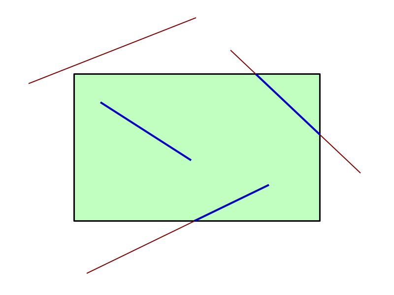
]

.pull-right[
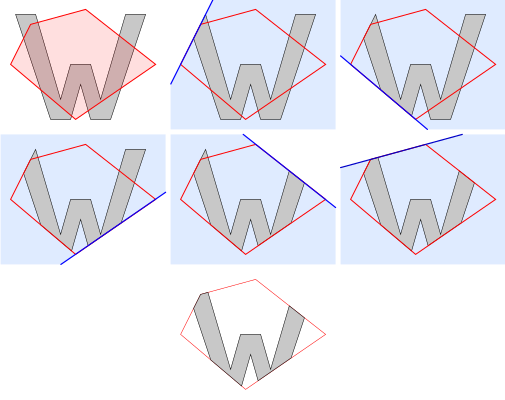
]

---

## Отсечение отрезков

Один из самых широко используемых — __алгоритм Коэна-Сазерленда__, в котором используется разбиение плоскости на 9 частей прямыми, координаты которых определяются границами прямоугольника (в частности — порта просмотра):

.pull-left[
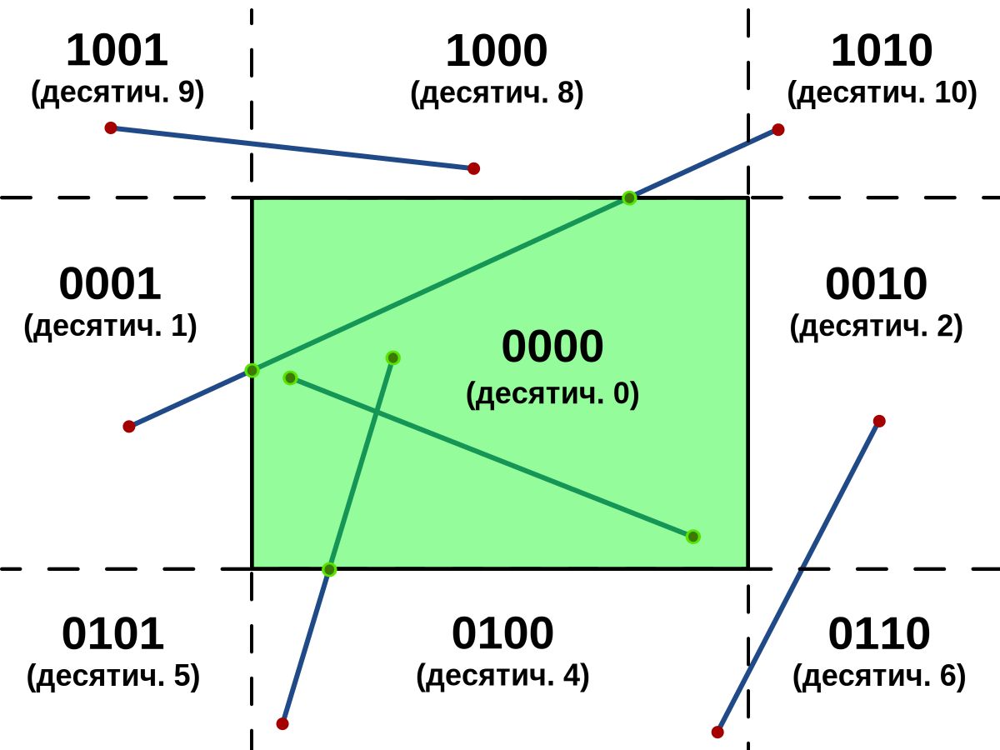
.small[https://upload.wikimedia.org/
wikipedia/commons/b/bc/Cohen-sutherland.svg]
]

.pull-right[

- `INSIDE = 0` — $0000$
- `LEFT = 1` — $0001$
- `RIGHT = 2` — $0010$
- `BOTTOM = 4` — $0100$
- `TOP = 8` — $1000$

.small[Отрезки, обе точки которых находятся по одну сторону от прямоугольника, имеют совпадающий единичный бит в одной и той же позиции]
]

---

## Вычисление кодов Коэна-Сазерленда

Пусть дана точка $(x, y)$, а также границы порта просмотра $(x_{min}, x_{max})$, $(y_{min}, y_{max})$.

Тогда код вычисляется следующим образом:

```{python, eval = F}
def code(x, y, xmax, ymax):
    code = INSIDE
    if x < 0:
        code |= LEFT
    elif x > xmax:
        code |= RIGHT
    if y < 0:
        code |= BOTTOM
    elif y > ymax:
        code |= TOP
    return code
```

В данном случае применяется операция _логическое ИЛИ_, которая устанавливает в каждый бит $1$, если хотя бы у одного из операндов соответствующий бит равен $1$.

---

## Алгоритм Коэна-Сазерленда

Для каждого отрезка $(x_0, y_0), (x_1, y_1)$ выполняется бесконечный цикл, внутри которого ведутся следующие действия:

1. Вычисляются коды `code0` и `code1` для концов отрезка.
1. Если оба конца находятся внутри порта просмотра (`code0 | code1 == 0`), то отрезок принимается целиком и цикл прерывается.
1. Если оба конца находятся по одну сторону от порта просмотра (`code0 & code1 != 0`), то отрезок отклоняется целиком и цикл прерывается.
1. В противном случае (оба конца находятся по разные стороны от порта просмотра), выполняются следующие действия:

    - Выбирается любая точка, находящаяся за пределами порта просмотра.
    - Выполняется пересечение отрезка с прямой, определяющей ту сторону, в которой находится выбранная точка.
    - Выбранная точка заменяется на найденное пересечение.

---

## Отсечение многоугольников

Один из самых широко используемых — __алгоритм Сазерленда-Ходжмана__, в котором итеративно просматривается каждое ребро ограничивающей выпуклой области (порта просмотра), и оставляются только те вершины исходного многоугольника, которые лежат в той полуплоскости, что и сама ограничивающая область.


.small[https://upload.wikimedia.org/wikipedia/commons/5/53/Sutherland-Hodgman_clipping_sample.svg]

---

## Алгоритм Сазерленда-Ходжмана

```{python, eval = FALSE}
output_line = np.array([[ix0, iy0], [ix1, iy1], ..., [ix0, iy0])
clip_ring = np.array([[cx0, cy0], [cx1, cy1], ..., [cx0, cy0]])

for i in range(length(clip_ring) - 1):
  clip_edge = clip_ring[(i, i+1), :]
  input_line = output_line
  output_line = np.empty((0, 2))
  n = length(input_line)

  for j in range(n-1)
    cur_point = line[j];
    next_point = line[j+1]

    if inside(next_point, clip_edge):
      if not inside(cur_point, clip_edge):
        int_point = intersect(cur_point, next_point, clip_edge)
        output_line = np.vstack((output_line, int_point));
      output_line = np.vstack((output_line, next_point))

    elif inside(cur_point, clip_edge):
      int_point = intersect(cur_point, next_point, clip_edge)
      output_line = np.vstack((output_line, int_point);

  if not np.all(output_line[0] == output_line[-1]):
    output_line = np.vstack((output_line, output_line[0]))
```

---

## Аффинное преобразование

В системах двумерной визуализации данных фундаментальную роль играют _аффинные преобразования_.

__Аффинное преобразование__ $f\colon\mathbb{R}^{n}\to \mathbb{R}^{n}$ есть преобразование вида:

$$f(x) = M \cdot x + v,$$

где $M$ — _обратимая матрица_ (квадратная матрица, определитель которой отличен от нуля) и $v\in \mathbb{R}^{n}$.

С помощью аффинных преобразований осуществляется __навигация__ по карте: _масштабирование, перемещение, поворот изображения_.

Частные случаи этих операций могут быть связаны с центрированием относительно объекта, а также "вписыванием" объекта или множества объектов в пределы экрана.

---

## Матрица аффинного преобразования

Используются однородные координаты, в которых дополнительная компонента равняется 1. Для одномерного случая:

$$\begin{bmatrix} \vec{y} \\ 1 \end{bmatrix} = \left[ \begin{array}{ccc|c} \, & A & & \vec{b} \ \\ 0 & \ldots & 0 & 1 \end{array} \right] \begin{bmatrix} \vec{x} \\ 1 \end{bmatrix}$$

Это равносильно решению уравнения:

$$
\vec{y} = A \vec{x} + \vec{b}.
$$
---

## Сдвиг

При сдвиге в матрице главная диагональ заполнена единицами, а в последнем столбце появаляются компоненты сдвига:

$$\begin{bmatrix} x' \\ y' \\ 1 \end{bmatrix} = \underbrace{\begin{bmatrix} 1 &  0 & t_x \\ 0 & 1 & t_y \\ 0 & 0 & 1 \end{bmatrix}}_{\mathbf T(t_x, t_y)} \begin{bmatrix} x \\ y \\ 1 \end{bmatrix} = \begin{bmatrix} 1x + 0y + t_x1 \\ 0x + 1y + t_y1 \\ 0x + 0y + 1 \end{bmatrix} = \begin{bmatrix} x + t_x \\ y + t_y \\ 1 \end{bmatrix},$$
где $t$ — вектор трансляции.

---

## Поворот

При повороте заполняется верхний левый блок матрицы:

$$\begin{bmatrix} x' \\ y' \\ 0 \end{bmatrix} = \underbrace{\begin{bmatrix} \cos \theta &  -\sin \theta & 0 \\ \sin \theta & \cos \theta  & 0 \\ 0 & 0 & 1 \end{bmatrix}}_{\mathbf R(\theta)} \begin{bmatrix} x \\ y \\ 1 \end{bmatrix} = \begin{bmatrix} x \cos \theta - y \sin \theta \\ x \sin \theta + y \cos \theta \\ 1 \end{bmatrix},$$
где $\theta$ - угол поворота.

---

## Масштабирование

Чтобы отмасштабировать объект на коэффициенты $a_x$ и $a_y$, используется следующая форма:

$$\begin{bmatrix} x' \\ y' \\ 1 \end{bmatrix} = \underbrace{\begin{bmatrix} s_x &  0 & 0 \\ 0 & s_y  & 0 \\ 0 & 0 & 1 \end{bmatrix}}_{\mathbf S(s_x, s_y)} \begin{bmatrix} x \\ y \\ 1 \end{bmatrix},$$

- при навигации по карте $s_x = s_y = a$
- для зеркального отражения по соответствующим осям $s_x$ или $s_y$ будут иметь отрицательные значения.

---

## Стандартные сценарии

При загрузке слоя данных в пустой проект по умолчанию все объекты вписываются в порт просмотра.

Пусть ограничивающий прямоугольник (_экстент_) данных имеет размеры $[x_0, y_0]\times[x_1, y_1]$, а размер порта просмотра $[0, di]\times[0, dj]$. Тогде необходимо выполнить следующие преобразования:

- Совместить начало координат с центром экстента данных — точкой $[(x_1 + x_0)/2, (y_1 + y_0)/2]$.

- На овнове сравнения пропорций экстента $\frac{dx}{dy}$ и порта просмотра $\frac{di}{dj}$ выбрать коэффициент масштабирования $s$:

$$s = \begin{cases}
\frac{di}{dx},~\texttt{если}~\frac{dx}{dy} \leq \frac{di}{dj}\\
\frac{dj}{dy},~\texttt{если}~\frac{dx}{dy} > \frac{di}{dj}\\
\end{cases}$$

---

## Стандартные сценарии

- Отмасштабировать координаты на полученный коэффициент $s$.

- Переместить отмасштабированное изображение в точку $(di/2, dj/2)$.

Итоговая матрица преобразования $\textbf{A}$ будет выглядеть следующим образом:

$$\textbf A = \textbf T(di/2, dj/2)~\textbf S(s)~\textbf T(-(x_1 + x_0)/2, -(y_1 + y_0)/2)$$

Точки исходных объектов $p$ будут трансформированы в точки внутри порта просмотра $p'$ как:

$$p' = \textbf A p$$

---

## Стандартные сценарии

Пусть текущая матрица отображения равна $A$. Пользователь:

- перетащил изображение из точки $(i_1, j_1)$ в точку $(i_2, j_2)$:

$$\mathbf A = \mathbf T(i_2-i_1, j_2 - j_1)\mathbf A$$
- в точке $(i, j)$ прокрутил колесико мыши на $k > 0$ оборота:

$$\mathbf A = \mathbf T(i, j)~\mathbf S(ks, ks)~\mathbf T(-i, -j)~\mathbf A$$
- в точке $(i, j)$ прокрутил колесико мыши на $k < 0$ оборота:

$$\mathbf A = \mathbf T(i, j)~\mathbf S(-\frac{1}{ks}, -\frac{1}{ks})~\mathbf T(-i, -j)~\mathbf A$$
Каждый оборот соответствует изменению масштаба в $s$ раз. Отрицательные обороты соответствуют уменьшению масштаба, положительные — увеличению.

---

## Передискретизация (resampling)

Передискретизация необходима при визуализации растрового изображения на растровом экране. Как правило, разрешение этих растров не совпадает.

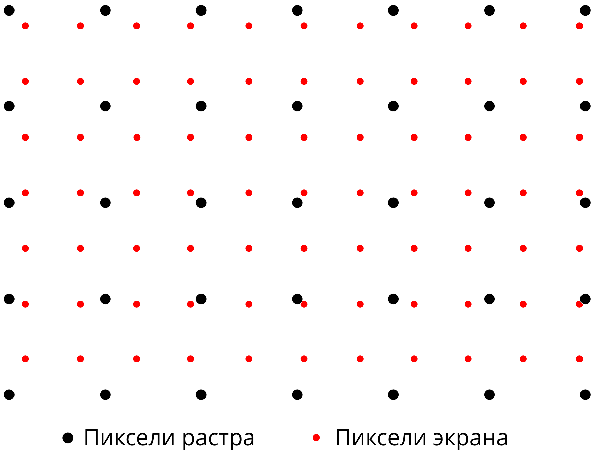

---

## Метод ближайшего соседа

Используется значение ближайшего пикселя:

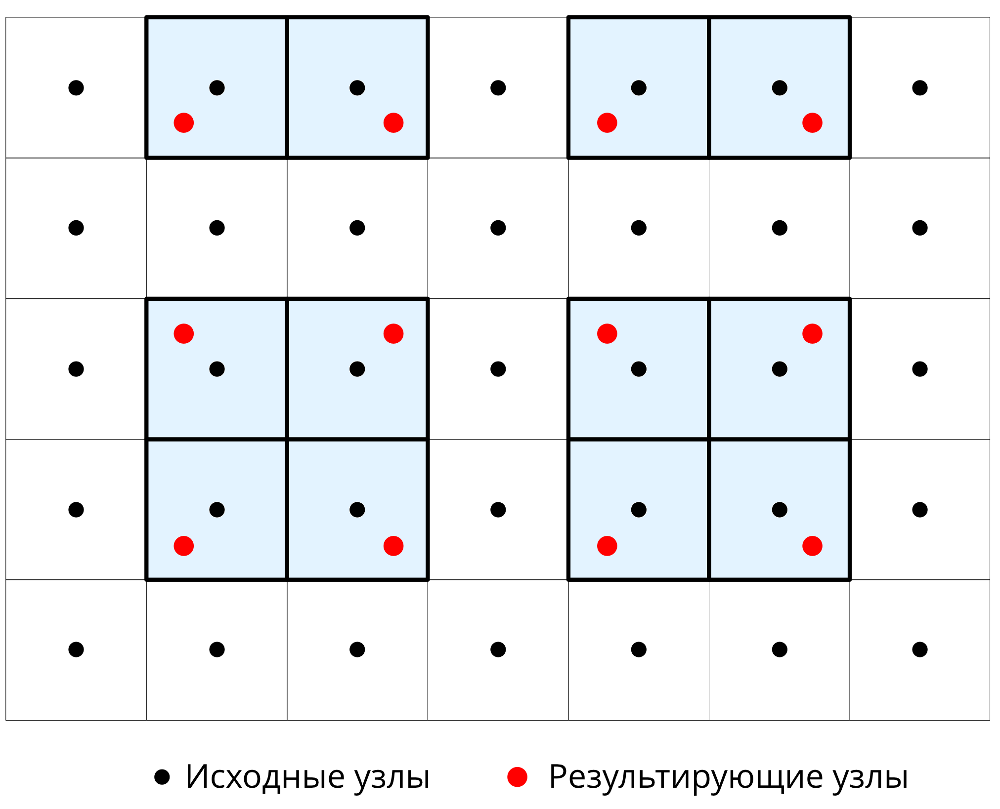

---

## Метод билинейной интерполяции

Восстанавливается поверхность в ячейке из 4 узлов:


---

## Метод билинейной интерполяции

.left-40[
  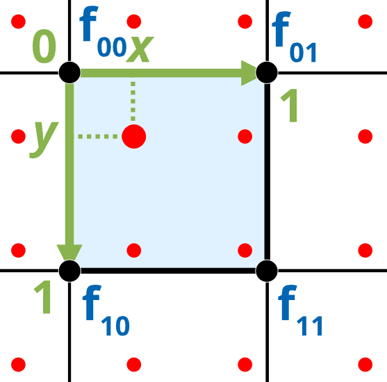
]

.right-60[
Коэффициенты определяются по 4 точкам:

$$\begin{cases}
a_{00} = f_{00},\\
a_{10} = f_{10} - f_{00},\\
a_{01} = f_{01} - f_{00},\\
a_{01} = f_{00} + f_{11} - f_{10} - f_{01}.
\end{cases}$$

$$f(x, y) = a_{00} + a_{10}x + a_{01}y + a_{11}xy$$]

Координаты $x$ и $y$ меняются в диапазоне от $0$ до $1$ в пределах ячейки.

---

## Метод бикубической интерполяции

Восстанавливается поверхность в 9 ячейках, окружающих узел:


---

## Метод бикубической интерполяции

.left-40[

]

.right-60[
Коэффициенты определяются по 16 точкам:

$$\begin{cases}
f(0,0) = a_{00},\\
f(1,0) = a_{00} + a_{10} + a_{20} + a_{30},\\
f(0,1) = a_{00} + a_{01} + a_{02} + a_{03},\\
f(1,1) = \sum_{i=0}^3 \sum_{j=0}^3 a_{ij},\\
\dots
\end{cases}$$

$$f(x, y) = \sum_{i=0}^3 \sum_{j=0}^3 a_{ij} x^i y^j$$
]

Координаты $x$ и $y$ меняются в диапазоне от $0$ до $1$ в пределах окрестности $3 \times 3$ ячеек.

---

## Передискретизация и фильтрация

.pull-left[
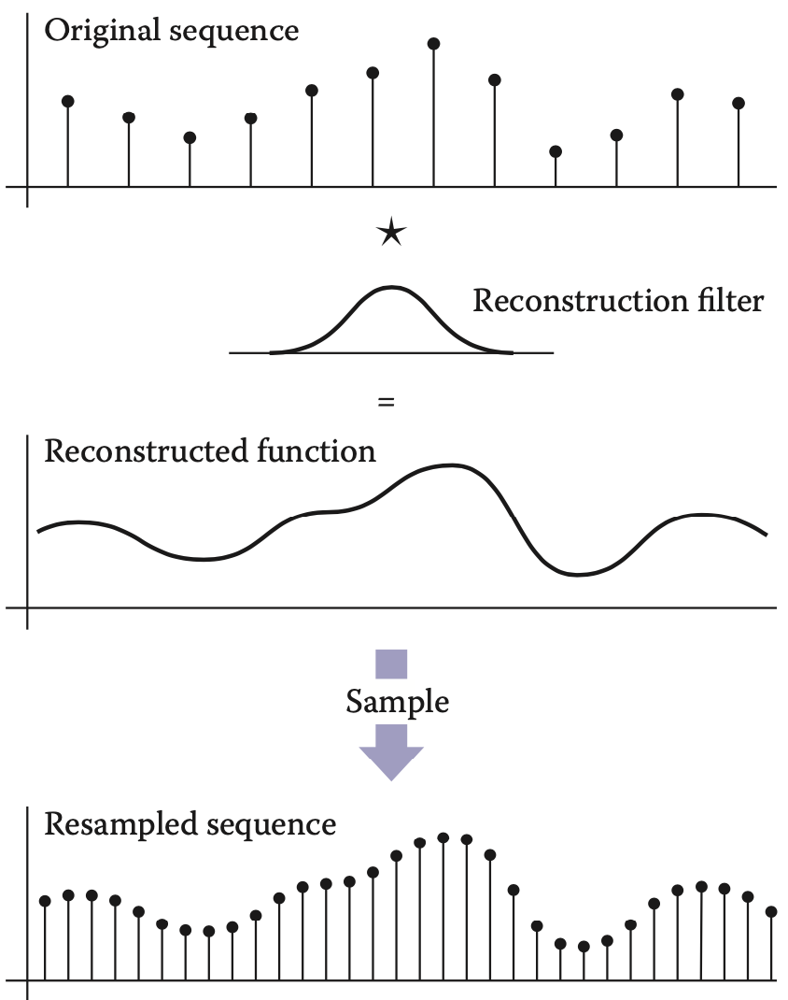
.small[_Marschner et al., 2016_]
]
.pull-right[
Передискретизацию можно также рассматривать как двухстадийный процесс:

- Построение гладкой непрерывной функции путем применения реконструкционного фильтра

- Выборка (семплирование) значений функции в локациях, определенных узлами новой сетки
]

---

## Передискретизация и фильтрация

Псевдокод одномерной передискретизации:

```{python, eval = FALSE}
fun resample(sequence a, float x0, float dx, int n, filter f)
  b = list(length = n)
  for i = 0 to n-1 do
    b[i] = reconstruct(a, f, x0 + i * dx)
  return b
```

Параметр `x0` отвечает за расположение первого элемента выборки в системе координат исходной последовательности.

Например, если этот элемент расположен посередине между 0-м и 1-м элементом исходной последовательности, то `x0 = 0.5`

---

## Дискретно-непрерывная свёртка

Восстановление непрерывной поверхности происходит путем взвешенного осреднения исходных значений. Веса определяются свёрточным ядром:
.left-60[
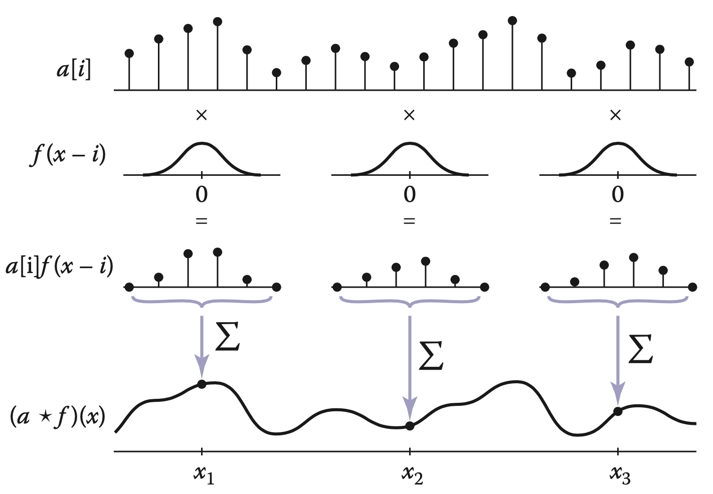

.small[_Marschner et al., 2016_]
]
.right-40[
Свертка есть результат произведения функций:
$$(a \star f)(x) = \sum_i a[i] f(x-i)$$

Для ядра ограниченного радиуса $r$:
$$(a \star f)(x) = \sum_{i = \lceil x-r\rceil}^{\lfloor x+r \rfloor} a[i] f(x-i)$$
]

---

## Дискретно-непрерывная свёртка

.left-60[
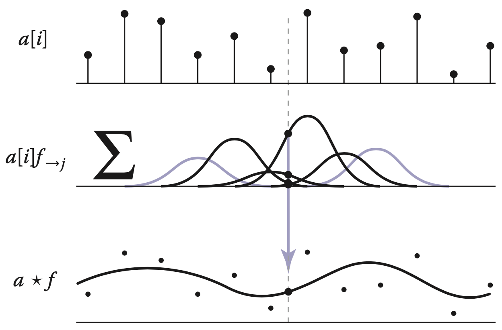

.small[_Marschner et al., 2016_]
]
.right-40[
Восстановленную функцию можно получить путем суммирования произведений фильтра и исходного значения в точках $i$:
$$(a \star f) = \sum_i a[i] f_{\to i}$$
]

---

## Дискретно-непрерывная свёртка

Псевдокод:

```{python, eval = F}
fun reconstruct(sequence a, filter f , real x)
  s=0
  r = f.radius
  for i = ⌈x − r⌉ to ⌊x + r⌋ do
    s = s + a[i]f (x − i)
  return s
```

---

## Популярные фильтры

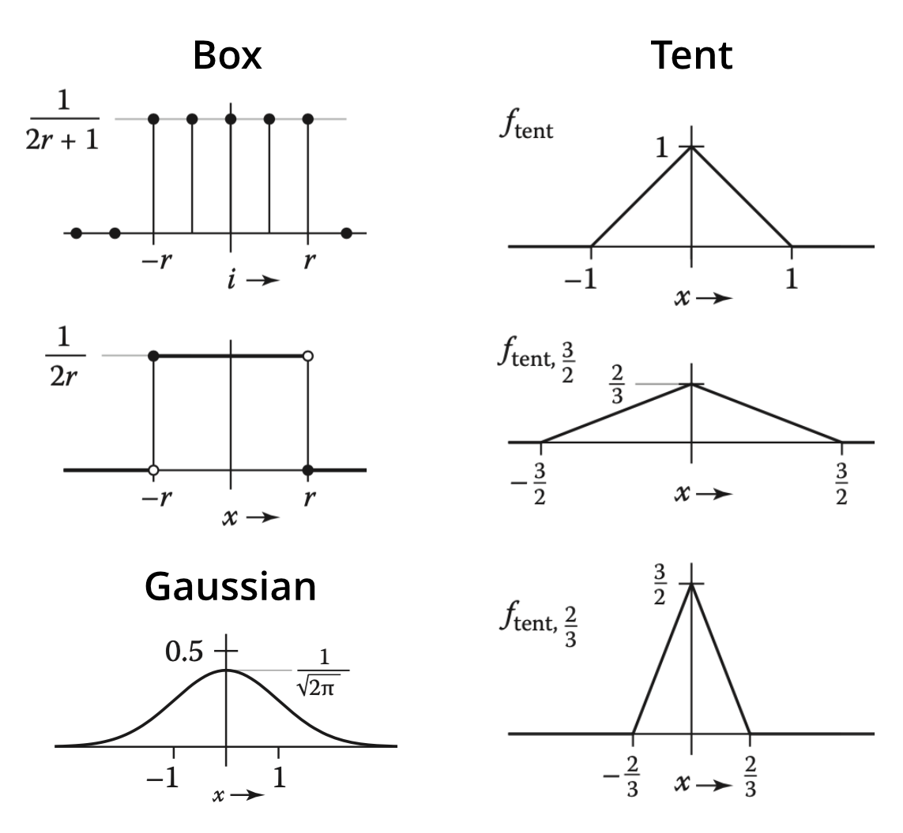

---

## Передискретизация и фильтрация

Проблема передискретизации при даунсемплинге (понижении разрешения) заключается в появлении артефактов таких как муар (слева) и зубчатость (справа):

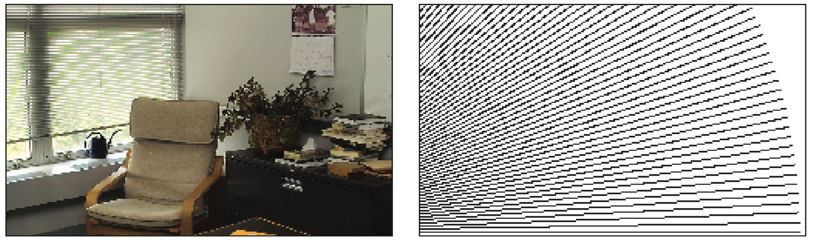
.small[_Marschner et al., 2016_]

Поэтому при понижении разрешения помимо реконструкционного фильтра необходимо использовать также сглаживающий.

---

## Передискретизационный фильтр

Поскольку свёрточные фильтры можно перемножать, для комбинирования реконструкции и сглаживания достаточно провести фильтрацию один раз (диагональная стрелка):

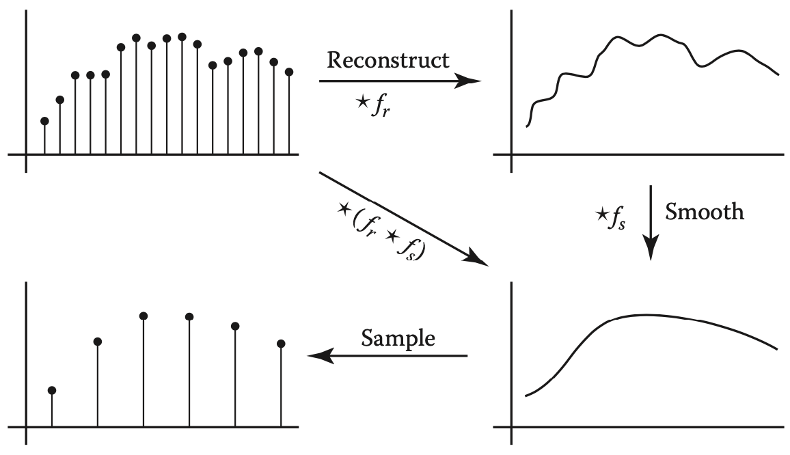

.small[_Marschner et al., 2016_]

---

## Передискретизация и фильтрация

Прямоугольный домен изображения размером $n_x \times n_y$:

$$R = [-0.5, n_x - 0.5] \times [-0.5, n_y - 0.5]$$
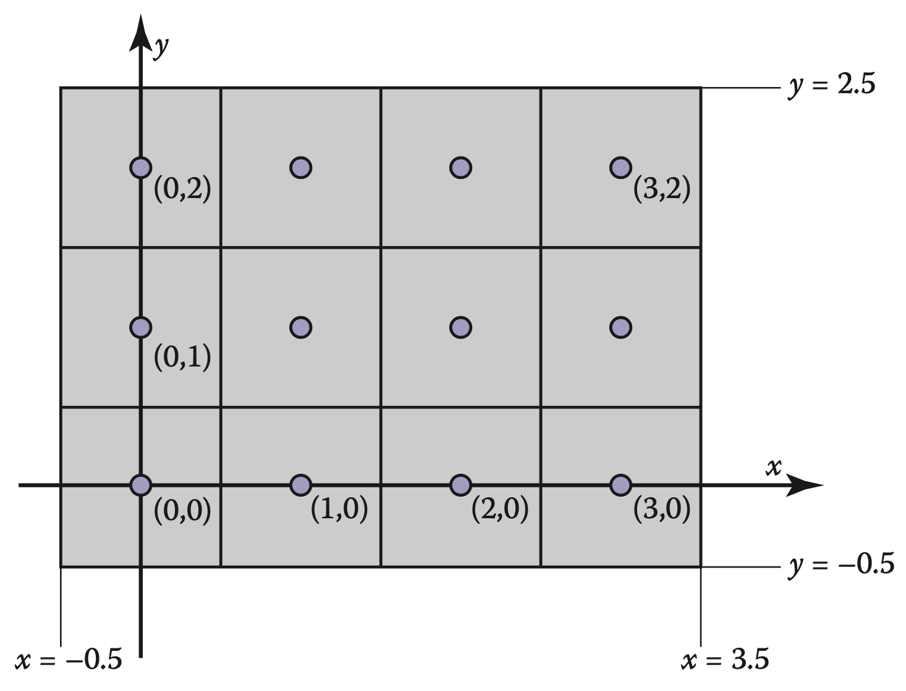

.small[_Marschner et al., 2016_]

---

## Передискретизация и фильтрация

Псевдокод одномерной сглаживающей передискретизации:

```{python, eval = FALSE}
fun resample(sequence a, float xmin, float xmax, int n, filter f)
  b = list(length = n)
  r = f.radius
  dx = (xmax - xmin)/n
  x0 = xmin + dx/2
  for i = 0 to n-1 do
    s = 0
    x = x0 + i * dx
    for j = ceil(x-r) to floor(x+r) do
      s = s + a[j] * f(x - j)
    b[i] = s
  return b
```

Параметры `xmin` и `xmax` обозначают минимальную и максимальную растровую координату по измерению `X`. Для полного изображения `xmin = -0.5`, `xmax = nx - 0.5`.

---

## Фильтрация на границе растра

Если фильтр выходит за границу растра, возможно три варианта:

- Не обрабатывать такие пикселы. В этом случае они будут заполнены нулями.

- Обрезать все индексы до минимально и максимально возможной координаты. В этом случае при индексации $a[-1]$ будет возвращаться $a[-0]$, а при индексации $a[|a|]$ будет возвращаться $a[|a|-1]$.

- Модифицировать фильтра для граничных ячеек. Например, заменить бикубическую интерполяцию на билинейную. Если используется сверточный фильтр, то уменьшение числа его элементов требует ренормализации значений (разделить на сумму элементов, перекрывающих фильтруемый растр).

---

## Метод бикубической интерполяции

Keys (1981) показал, что бикубическую реконструкцию можно реализовать путем свёртки с использованием следующего фильтра:

$$W(x) = \begin{cases}
 (a+2)|x|^3-(a+3)|x|^2+1 & \text{для } |x| \leq 1, \\
 a|x|^3-5a|x|^2+8a|x|-4a & \text{для } 1 < |x| < 2, \\
 0                       & \text{иначе},
\end{cases},$$

где $a = -0.5$ или $a = -0.75$.

_R. Keys._ Cubic convolution interpolation for digital image processing // __IEEE Transactions on Acoustics, Speech, and Signal Processing__ — 1981. — Vol. 29, no. 6. — P. 1153—1160. — doi:10.1109/TASSP.1981.1163711

---

## Сглаживание (antialiasing)

При крупном размере пиксела выводящего устройства ступенчатость линий и границ полигонов становится заметной.

Для устранения эффекта ступенчатости используется __сглаживание__ (_antialiasing_).

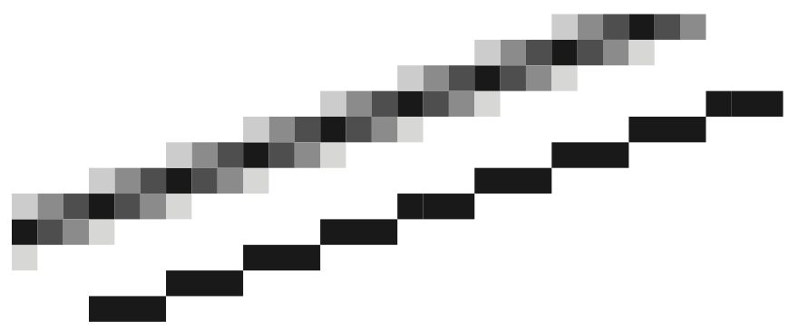

Вверху — со сглаживанием, внизу — без (.small[_Marschner et al., 2016_])

---

## Сглаживание (antialiasing)


.small[https://www.neogamr.net/what-is-anti-aliasing/]

---

## Суперсемплинг (antialiasing)

Пусть результирующее растровое изображение $R$ имеет размеры $m \times n$.

1. Создается буферное изображение $R_b$ размером $km \times kn$, где $k \in \mathbb{N^*}$ — коэффициент сглаживания (положительное натуральное число).
2. Объекты отрисовываются в $R_b$.
3. Производится передискретизация $R_b \to R$ с использованием блочной фильтрации (_box filter_). Значение результирующего пиксела $R[i, j]$ равняется среднему арифметическому значений $R_b$, попадающих в его пределы:

$$R[i, j] = \sum_{l = 1}^L s(R_b) / L,$$

где $s(R_b)$ — выборочное значение (сэмпл), взятое с $R_b$.

---

## Стратегии семплирования

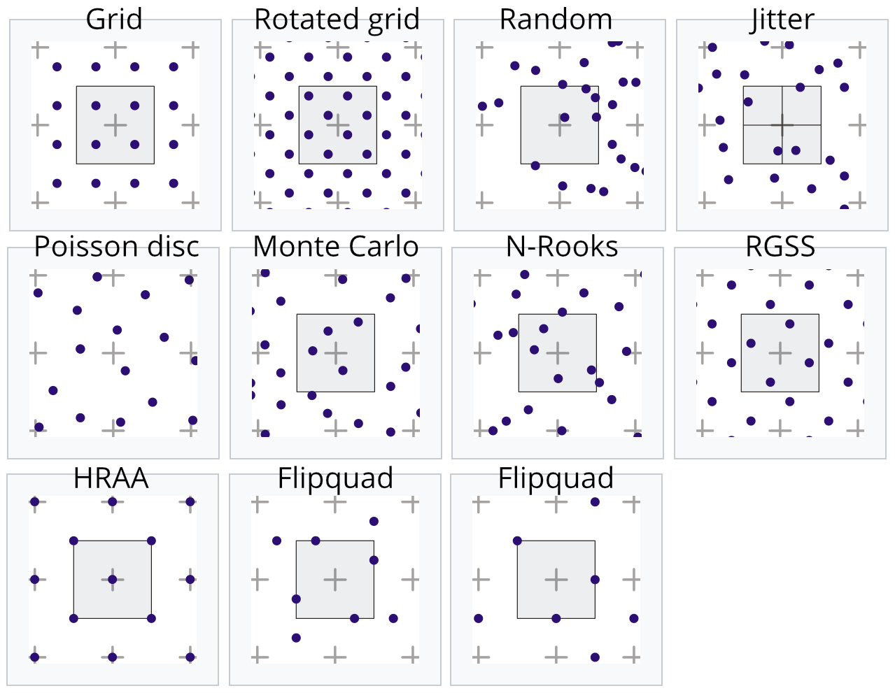
.small[https://en.wikipedia.org/wiki/Supersampling]