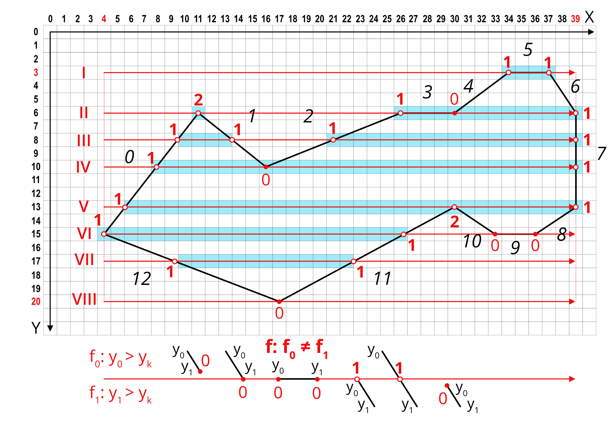

```{r setup, include=FALSE}
options(htmltools.dir.version = FALSE)
library(tidyverse)
library(raster)
library(spatstat)
library(stars)
library(tmap)
library(sf)
library(sp)
```

## Компьютерная графика

Наука и искусство визуальной коммуникации посредством компьютерного дисплея и инструментом интерактивного взаимодействия с ним.

- Визуальный аспект: компьютер -> человек
- Интерактивный аспект: человек -> компьютер


---

## Мультидисциплинарность

- физика

- математика

- человеческое зрение

- человеко-машинное взимодействие

- программная и аппаратная инженерия

- графический дизайн

- ...

---

## Связь с компьютерным зрением

__Компьютерная графика__: реализация с определенного ракурса внешнего вида сцены, в которую погружены модели объектов под заданными условиями освещения.

__Компьютерное зрение__: определение параметров сцены и погруженных в нее объектов при заданных допущениях.


.small[_Lesage, Visvalingam, 2002_]

---

## Графический конвейер


.small[_Hughes et al, 2013_]

---

## Графический конвейер


Взаимодействие с пользователем может оказывать влияние на последующее поведение графического приложения

---

## Графический конвейер 2D-приложения

.pull-left[
  
]

.pull-right[
__Графическая платформа__ отвечает за взаимодействие приложения и оборудования

__Модель приложения__ (application model) представляет визуализируемые данные

__Клиентская область__ (client area) определяет пространство, в котором приложение выполняет отрисовку.

__Порт просмотра__ (viewport) определяет часть клиентской области, где генератор сцены выполняет отрисовку модели
]

---

## Эволюция графической платформы

__1980-е — начало 1990-х__ _(Apple QuickDraw, Microsoft GDI)_: отрисовка пикселей на прямоугольной канве в целочисленных координатах. Отрисовка .red[_примитивов_]: геометрических форм или битмапов (пиксельных карт). 
  - Точка $(0,0)$ располагается в левом верхнем углу.
  - Каждый примитив заполняется путем вызова определенной функции (например, `FillRectangle`).
  - Размер объекта зависит от разрешения объекта. Более низкое разрешение (крупные пикселы) — больше размеры объектов.
  
__Середина 1990-х — н.вр.__ Переход к координатам с плавающей точкой позволил решить проблему зависимости размера изображения от системы координат.

---

## Непосредственный режим 

В .blue[__непосредственном режиме__] _(immediate mode)_ клиент через графическую платформу обращается непосредственно к выводящему устройству. 
- Запись примитивов, переданных приложением, не выполняется. 
- При смене сцены приложение должно перерисовать ее целиком. 


---

## Сохраненный режим 

В .red[__сохраненном режиме__] _(retained mode)_ графическая платформа хранит спецификацию сцены в виде специализированной базы данных, которая называется графом сцены _(scene graph)_. 
- Объекты могут добавляться в граф сцены последовательно.
- Каждое изменение графа приводит к перерисовке сцены


---

## Процедурный и декларативный подходы

.blue[__Процедурный код__] пишется на императивном языке программирования 
- Описывает _действия_
- Стандарт при взаимодействии с графической платформой 
- В геоинформационных пакетах применяется на низком уровне, невидимом для пользователя

.red[__Декларативные спецификации__] фиксируются на языке разметки
- Описывают _результаты_
- Вспомогательное средство в графических платформах
- В геоинформационных пакетах применяется на высоком уровне при описании стилей карт (CSS, LYR, QML, SLD, YSLD)

---

## Процедурный код

Классический низкоуровневый пример — отрисовка линии.

`draw_line(x0, y0, x1, y1)`


.blue[__Алгоритм Брэзенхема__]
.small[_Bresenham, J. E._ (1965). "Algorithm for computer control of a digital plotter" (PDF). __IBM Systems Journal__. 4 (1): 25–30. doi:10.1147/sj.41.0025.]

---

## Алгоритм Брезенхэма

Cистема экранных координат $XY$, где $X$ — столбец (увеличивается слева направо), $Y$ — строка (увеличивается сверху вниз)

- $(x_0, y_0)$ — начальная точка отрезка в экранных координатах
- $(x_1, y_1)$ — конечная точка отрезка в экранных координатах

Уравнение отрезка:
$$\frac{y - y_0}{y_1-y_0} = \frac{x - x_0}{x_1-x_0}$$
Выразив $y$, получаем:
$$y = \color{red}{\underbrace{\frac{y_1 - y_0}{x_1-x_0}}_{\textbf{d (уклон)}}} (x - x_0) + y_0$$
---

## Алгоритм Брезенхэма

_Стандартно_ рассматривается отрисовка линии, которая располагается в секторе `В-ЮВ`, т.е. идет относительно начальной точки вправо и полого вниз при соблюдении следующих условий:
- $x_0 \geq 0,~y_0 \geq 0$;
- $x_0 < x_1,~y_0 \leq y_1$;
- $x_1 - x_0 \geq y_1 - y_0$.


---

## Алгоритм Брезенхэма

Для сектора `В-ЮВ` алгоритм опирается на координаты $x$:

.pull-left[__Вычисляем заранее__:
- $dx = x_1 - x_0$.
- $dy = y_1 - y_0$.
- $\color{blue}{d = dy / dx}$;
- $\color{blue}{y = y_0}$;
- $e = 0$]

.pull-right[__Для $\color{blue}{x = x_0, ... x_1}$, выполняем__:
1. Рисуем пиксель $(x, y)$.
2. Обновляем ошибку $e = e + |d|$.
3. Если $e \geq 0.5$, то:
  - $\color{blue}{y = y + \texttt{sign}(dy)}$,
  - $e = e - 1$.]
  
Использование функции $\texttt{sign}$ позволяет применять алгоритм также и для сектора `В-СВ` (только $y$ будет уменьшаться).

Обозначим этот случай как `draw_line_byX(x0, y0, x1, y1)`

---

## Алгоритм Брезенхэма

.pull-left[_Альтернативно_ рассматривается отрисовка линии, которая располагается в секторе `Ю-ЮВ`, т.е. идет относительно начальной точки вправо и круто вниз при соблюдении следующих условий:
- $x_0 \geq 0,~y_0 \geq 0$;
- $x_0 \leq x_1,~y_0 < y_1$;
- $x_1 - x_0 < y_1 - y_0$.]

.pull-right[]

---

## Алгоритм Брезенхэма

Для сектора `Ю-ЮВ` алгоритм опирается на координаты $y$:

.pull-left[__Вычисляем заранее__:
- $dx = x_1 - x_0$.
- $dy = y_1 - y_0$.
- $\color{red}{d = dx / dy}$;
- $\color{red}{x = x_0}$;
- $e = 0$]

.pull-right[__Для $\color{red}{y = y_0, ... y_1}$, выполняем__:
1. Рисуем пиксель $(x, y)$.
2. Обновляем ошибку $e = e + |d|$.
3. Если $e \geq 0.5$, то:
  - $\color{red}{x = x + \texttt{sign}(dx)}$,
  - $e = e - 1$.]
  
Использование функции $\texttt{sign}$ позволяет применять алгоритм также и для сектора `Ю-ЮЗ` (только $x$ будет уменьшаться).

Обозначим этот случай как `draw_line_byY(x0, y0, x1, y1)`

---

## Алгоритм Брезенхэма

Для оставшихся направлений построение линий реализуется путем перестановки местами начальной и конечной точки. Код результирующей функции на языке __Python__:
```{python, eval=FALSE}
def plot_line(x0, y0, x1, y1):
    if abs(y1 - y0) < abs(x1 - x0): # пологая линия
        if x0 > x1:
            plot_line_byX(x1, y1, x0, y0)
        else:
            plot_line_byX(x0, y0, x1, y1)
    else:
        if y0 > y1:                 # крутая линия
            plot_line_byY(x1, y1, x0, y0)
        else:
            plot_line_byY(x0, y0, x1, y1)
```

где `abs()` — функция вычисления модуля.

---

## Заливка полигона


---

## Заливка полигона

.blue[__Алгоритм сканирующей линии:__]

Для каждого $y_k = y_{min},...,y_{max}$ необходимо получить упорядоченное по возрастанию множество $X = \{x_1, x_2, ..., x_n\}$ абсцисс точек его пересечения с исходными линиями:
1. Для каждой линии $l_j, j = 1,...,N$:
  - вычислить флаг пересечения $f: y^j_0 < y_k \neq y^j_1 < y_k$;
  - если $f = \texttt{TRUE}$, то
      - вычислить $x^j = x^j_0 + (x^j_1 - x^j_0)\frac{y_k - y^j_0}{y^j_1 - y^j_0}$;
      - добавить $x^j$ в множество $X$.
2. Если $X$ не пусто, то упорядочить его по возрастанию и выполнить закрашивание между его элементами в порядке:

$$\lceil x_1 \rceil \to \lfloor x_2 \rfloor,~\lceil x_3 \rceil \to \lfloor x_4 \rfloor,~...~,~\lceil x_{n-1} \rceil \to \lfloor x_n \rfloor$$

---

## Передискретизация (resampling)

Передискретизация необходима при визуализации растрового изображения на растровом экране. Как правило, разрешение этих растров не совпадает.


---

## Метод ближайшего соседа

Используется значение ближайшего пикселя:


---

## Метод билинейной интерполяции

Восстанавливается поверхность в ячейке из 4 узлов:


---

## Метод билинейной интерполяции

.left-40[
  
]

.right-60[
Коэффициенты определяются по 4 точкам:
$$\begin{cases}
a_{00} = f_{00},\\
a_{10} = f_{10} - f_{00},\\
a_{01} = f_{01} - f_{00},\\
a_{01} = f_{00} + f_{11} - f_{10} - f_{01}.
\end{cases}$$

$$f(x, y) = a_{00} + a_{10}x + a_{01}y + a_{11}xy$$]


Координаты $x$ и $y$ меняются в диапазоне от $0$ до $1$ в пределах ячейки.

---

## Метод бикубической интерполяции

Восстанавливается поверхность в 9 ячейках, окружающих узел:


---

## Метод бикубической интерполяции

.left-40[

]

.right-60[
Коэффициенты определяются по 16 точкам:

$$\begin{cases}
f(0,0) = a_{00},\\
f(1,0) = a_{00} + a_{10} + a_{20} + a_{30},\\
f(0,1) = a_{00} + a_{01} + a_{02} + a_{03},\\
f(1,1) = \sum_{i=0}^3 \sum_{j=0}^3 a_{ij},\\
\dots
\end{cases}$$

$$f(x, y) = \sum_{i=0}^3 \sum_{j=0}^3 a_{ij} x^i y^j$$ 
]

Координаты $x$ и $y$ меняются в диапазоне от $0$ до $1$ в пределах окрестности $3 \times 3$ ячеек.

---

## Передискретизация и фильтрация

.pull-left[

.small[_Marschner et al., 2016_]
]
.pull-right[
Передискретизацию можно также рассматривать как двухстадийный процесс:
- Построение гладкой непрерывной функции путем применения реконструкционного фильтра

- Выборка (семплирование) значений функции в локациях, определенных узлами новой сетки
]

---

## Передискретизация и фильтрация

Псевдокод одномерной передискретизации:

```{python, eval = FALSE}
fun resample(sequence a, float x0, float dx, int n, filter f)
  b = list(length = n)
  for i = 0 to n-1 do
    b[i] = reconstruct(a, f, x0 + i * dx)
  return b
```

Параметр `x0` отвечает за расположение первого элемента выборки в системе координат исходной последовательности.

Например, если этот элемент расположен посередине между 0-м и 1-м элементом исходной последовательности, то `x0 = 0.5`

---

## Дискретно-непрерывная свёртка

Восстановление непрерывной поверхности происходит путем взвешенного осреднения исходных значений. Веса определяются свёрточным ядром:
.left-60[


.small[_Marschner et al., 2016_]
]
.right-40[
Свертка есть результат произведения функций:
$$(a \star f)(x) = \sum_i a[i] f(x-i)$$

Для ядра ограниченного радиуса $r$:
$$(a \star f)(x) = \sum_{i = \lceil x-r\rceil}^{\lfloor x+r \rfloor} a[i] f(x-i)$$
]

---

## Дискретно-непрерывная свёртка

.left-60[


.small[_Marschner et al., 2016_]
]
.right-40[
Восстановленную функцию можно получить путем суммирования произведений фильтра и исходного значения в точках $i$:
$$(a \star f) = \sum_i a[i] f_{\to i}$$
]

---

## Дискретно-непрерывная свёртка

Псевдокод:

```{python, eval = F}
fun reconstruct(sequence a, filter f , real x)
  s=0
  r = f.radius
  for i = ⌈x − r⌉ to ⌊x + r⌋ do
    s = s + a[i]f (x − i) 
  return s
```

---

## Популярные фильтры


---

## Передискретизация и фильтрация

Проблема передискретизации при даунсемплинге (понижении разрешения) заключается в появлении артефактов таких как муар (слева) и зубчатость (справа):


.small[_Marschner et al., 2016_]

Поэтому при понижении разрешения помимо реконструкционного фильтра необходимо использовать также сглаживающий.

---

## Передискретизационный фильтр

Поскольку свёрточные фильтры можно перемножать, для комбинирования реконструкции и сглаживания достаточно провести фильтрацию один раз (диагональная стрелка):


.small[_Marschner et al., 2016_]

---

## Передискретизация и фильтрация

Прямоугольный домен изображения размером $n_x \times n_y$:

$$R = [-0.5, n_x - 0.5] \times [-0.5, n_y - 0.5]$$


.small[_Marschner et al., 2016_]

---

## Передискретизация и фильтрация

Псевдокод одномерной сглаживающей передискретизации:

```{python, eval = FALSE}
fun resample(sequence a, float xmin, float xmax, int n, filter f)
  b = list(length = n)
  r = f.radius
  dx = (xmax - xmin)/n
  x0 = xmin + dx/2
  for i = 0 to n-1 do
    s = 0
    x = x0 + i * dx
    for j = ceil(x-r) to floor(x+r) do
      s = s + a[j] * f(x - j)
    b[i] = s
  return b
```

Параметры `xmin` и `xmax` обозначают минимальную и максимальную растровую координату по измерению `X`. Для полного изображения `xmin = -0.5`, `xmax = nx - 0.5`.

---

## Фильтрация на границе растра

Если фильтр выходит за границу растра, возможно три варианта:

- Не обрабатывать такие пикселы. В этом случае они будут заполнены нулями.

- Обрезать все индексы до минимально и максимально возможной координаты. В этом случае при индексации $a[-1]$ будет возвращаться $a[-0]$, а при индексации $a[|a|]$ будет возвращаться $a[|a|-1]$.

- Модифицировать фильтра для граничных ячеек. Например, заменить бикубическую интерполяцию на билинейную. Если используется сверточный фильтр, то уменьшение числа его элементов требует ренормализации значений (разделить на сумму элементов, перекрывающих фильтруемый растр).

---

## Метод бикубической интерполяции

Keys (1981) показал, что бикубическую реконструкцию можно реализовать путем свёртки с использованием следующего фильтра:

$$W(x) = \begin{cases}
 (a+2)|x|^3-(a+3)|x|^2+1 & \text{для } |x| \leq 1, \\
 a|x|^3-5a|x|^2+8a|x|-4a & \text{для } 1 < |x| < 2, \\
 0                       & \text{иначе},
\end{cases},$$

где $a = -0.5$ или $a = -0.75$. 

_R. Keys._ Cubic convolution interpolation for digital image processing // __IEEE Transactions on Acoustics, Speech, and Signal Processing__ — 1981. — Vol. 29, no. 6. — P. 1153—1160. — doi:10.1109/TASSP.1981.1163711

---

## Сглаживание (antialiasing)

При крупном размере пиксела выводящего устройства ступенчатость линий и границ полигонов становится заметной. 

Для устранения эффекта ступенчатости используется __сглаживание__ (_antialiasing_).


Вверху — со сглаживанием, внизу — без (.small[_Marschner et al., 2016_])

---

## Сглаживание (antialiasing)


.small[https://www.neogamr.net/what-is-anti-aliasing/]

---

## Суперсемплинг (antialiasing)

Пусть результирующее растровое изображение $R$ имеет размеры $m \times n$.

1. Создается буферное изображение $R_b$ размером $km \times kn$, где $k \in \mathbb{N^*}$ — коэффициент сглаживания (положительное натуральное число).
2. Объекты отрисовываются в $R_b$.
3. Производится передискретизация $R_b \to R$ с использованием блочной фильтрации (_box filter_). Значение результирующего пиксела $R[i, j]$ равняется среднему арифметическому значений $R_b$, попадающих в его пределы:

$$R[i, j] = \sum_{l = 1}^L s(R_b) / L,$$

где $s(R_b)$ — выборочное значение (сэмпл), взятое с $R_b$.

---

## Стратегии семплирования 


.small[https://en.wikipedia.org/wiki/Supersampling]

---

## Аффинное преобразование

В системах двумерной визуализации данных фундаментальную роль играют _аффинные преобразования_.

__Аффинное преобразование__ $f\colon\mathbb{R}^{n}\to \mathbb{R}^{n}$ есть преобразование вида: 

$$f(x) = M \cdot x + v,$$

где $M$ — _обратимая матрица_ (квадратная матрица, определитель которой отличен от нуля) и $v\in \mathbb{R}^{n}$.

С помощью аффинных преобразований осуществляется __навигация__ по карте: _масштабирование, перемещение, поворот изображения_. 

Частные случаи этих операций могут быть связаны с центрированием относительно объекта, а также "вписыванием" объекта или множества объектов в пределы экрана.

---

## Матрица аффинного преобразования

Используются однородные координаты, в которых дополнительная компонента равняется 1. Для одномерного случая:

$$\begin{bmatrix} \vec{y} \\ 1 \end{bmatrix} = \left[ \begin{array}{ccc|c} \, & A & & \vec{b} \ \\ 0 & \ldots & 0 & 1 \end{array} \right] \begin{bmatrix} \vec{x} \\ 1 \end{bmatrix}$$

Это равносильно решению уравнения:

$$
\vec{y} = A \vec{x} + \vec{b}.
$$
---

## Сдвиг

При сдвиге в матрице главная диагональ заполнена единицами, а в последнем столбце появаляются компоненты сдвига:

$$\begin{bmatrix} x' \\ y' \\ 1 \end{bmatrix} = \underbrace{\begin{bmatrix} 1 &  0 & t_x \\ 0 & 1 & t_y \\ 0 & 0 & 1 \end{bmatrix}}_{\mathbf T(t_x, t_y)} \begin{bmatrix} x \\ y \\ 1 \end{bmatrix} = \begin{bmatrix} 1x + 0y + t_x1 \\ 0x + 1y + t_y1 \\ 0x + 0y + 1 \end{bmatrix} = \begin{bmatrix} x + t_x \\ y + t_y \\ 1 \end{bmatrix},$$
где $t$ — вектор трансляции.

---

## Поворот

При повороте заполняется верхний левый блок матрицы:

$$\begin{bmatrix} x' \\ y' \\ 0 \end{bmatrix} = \underbrace{\begin{bmatrix} \cos \theta &  -\sin \theta & 0 \\ \sin \theta & \cos \theta  & 0 \\ 0 & 0 & 1 \end{bmatrix}}_{\mathbf R(\theta)} \begin{bmatrix} x \\ y \\ 1 \end{bmatrix} = \begin{bmatrix} x \cos \theta - y \sin \theta \\ x \sin \theta + y \cos \theta \\ 1 \end{bmatrix},$$
где $\theta$ - угол поворота.

---

## Масштабирование

Чтобы отмасштабировать объект на коэффициенты $a_x$ и $a_y$, используется следующая форма:

$$\begin{bmatrix} x' \\ y' \\ 1 \end{bmatrix} = \underbrace{\begin{bmatrix} s_x &  0 & 0 \\ 0 & s_y  & 0 \\ 0 & 0 & 1 \end{bmatrix}}_{\mathbf S(s_x, s_y)} \begin{bmatrix} x \\ y \\ 1 \end{bmatrix},$$
- при навигации по карте $s_x = s_y = a$
- для зеркального отражения по соответствующим осям $s_x$ или $s_y$ будут иметь отрицательные значения.

---

## Стандартные сценарии

При загрузке слоя данных в пустой проект по умолчанию все объекты вписываются в порт просмотра. 

Пусть ограничивающий прямоугольник (_экстент_) данных имеет размеры $[x_0, y_0]\times[x_1, y_1]$, а размер порта просмотра $[0, di]\times[0, dj]$. Тогде необходимо выполнить следующие преобразования:

- Совместить начало координат с центром экстента данных — точкой $[(x_1 + x_0)/2, (y_1 + y_0)/2]$.

- На овнове сравнения пропорций экстента $\frac{dx}{dy}$ и порта просмотра $\frac{di}{dj}$ выбрать коэффициент масштабирования $s$:

$$s = \begin{cases}
\frac{di}{dx},~\texttt{если}~\frac{dx}{dy} \leq \frac{di}{dj}\\
\frac{dj}{dy},~\texttt{если}~\frac{dx}{dy} > \frac{di}{dj}\\
\end{cases}$$
  
---

## Стандартные сценарии

- Отмасштабировать координаты на полученный коэффициент $s$.

- Переместить отмасштабированное изображение в точку $(di/2, dj/2)$.

Итоговая матрица преобразования $\textbf{A}$ будет выглядеть следующим образом:

$$\textbf A = \textbf T(di/2, dj/2)~\textbf S(s)~\textbf T(-(x_1 + x_0)/2, -(y_1 + y_0)/2)$$

Точки исходных объектов $p$ будут трансформированы в точки внутри порта просмотра $p'$ как:

$$p' = \textbf A p$$

---

## Стандартные сценарии

Пусть текущая матрица отображения равна $A$. Пользователь:

- перетащил изображение из точки $(i_1, j_1)$ в точку $(i_2, j_2)$:

$$\mathbf A = \mathbf T(i_2-i_1, j_2 - j_1)\mathbf A$$
- в точке $(i, j)$ прокрутил колесико мыши на $k > 0$ оборота:

$$\mathbf A = \mathbf T(i, j)~\mathbf S(ks, ks)~\mathbf T(-i, -j)~\mathbf A$$
- в точке $(i, j)$ прокрутил колесико мыши на $k < 0$ оборота:

$$\mathbf A = \mathbf T(i, j)~\mathbf S(-\frac{1}{ks}, -\frac{1}{ks})~\mathbf T(-i, -j)~\mathbf A$$
Каждый оборот соответствует изменению масштаба в $s$ раз. Отрицательные обороты соответствуют уменьшению масштаба, положительные — увеличению.

---

## Отсечение

__Отсечение (clipping)__ — одна из финальных процедур графического конвейера, которая позволяет прорисовывать только те объекты, которые попадают в поле зрения наблюдателя.

В трехмерной графике объем видимости определяется пирамидой, ограниченной шестью плоскостями обрезки (_clipping planes_). На рисунке ниже объекты Б и В будут удалены:

.small[https://commons.wikimedia.org/wiki/File:Frustum_clipping.svg]

---

## Двумерное отсечение

В двумерной графике, которая широко используется в ГИС, стандартно используются алгоритмы отсечения отрезков и многоугольников.

> Отсечение отрезков и многоугольников выполняется после проецирования объектов в экранную систему координат.

.pull-left[

]

.pull-right[

]

---

## Отсечение отрезков

Один из самых широко используемых — __алгоритм Коэна-Сазерленда__, в котором используется разбиение плоскости на 9 частей прямыми, координаты которых определяются границами прямоугольника (в частности — порта просмотра): 

.pull-left[

.small[https://upload.wikimedia.org/
wikipedia/commons/b/bc/Cohen-sutherland.svg]
]

.pull-right[
- `INSIDE = 0` — $0000$
- `LEFT = 1` — $0001$
- `RIGHT = 2` — $0010$
- `BOTTOM = 4` — $0100$
- `TOP = 8` — $1000$

.small[Отрезки, обе точки которых находятся по одну сторону от прямоугольника, имеют совпадающий единичный бит в одной и той же позиции]
]

---

## Вычисление кодов Коэна-Сазерленда

Пусть дана точка $(x, y)$, а также границы порта просмотра $(x_{min}, x_{max})$, $(y_{min}, y_{max})$.

Тогда код вычисляется следующим образом:

```{python, eval = F}
def code(x, y, xmax, ymax):
    code = INSIDE
    if x < 0:
        code |= LEFT
    elif x > xmax:
        code |= RIGHT
    if y < 0:
        code |= BOTTOM
    elif y > ymax:
        code |= TOP
    return code
```

В данном случае применяется операция _логическое ИЛИ_, которая устанавливает в каждый бит $1$, если хотя бы у одного из операндов соответствующий бит равен $1$.

---

## Алгоритм Коэна-Сазерленда

Для каждого отрезка $(x_0, y_0), (x_1, y_1)$ выполняется бесконечный цикл, внутри которого ведутся следующие действия:

1. Вычисляются коды `code0` и `code1` для концов отрезка.
1. Если оба конца находятся внутри порта просмотра (`code0 | code1 == 0`), то отрезок принимается целиком и цикл прерывается.
1. Если оба конца находятся по одну сторону от порта просмотра (`code0 & code1 != 0`), то отрезок отклоняется целиком и цикл прерывается.
1. В противном случае (оба конца находятся по разные стороны от порта просмотра), выполняются следующие действия:
    - Выбирается любая точка, находящаяся за пределами порта просмотра.
    - Выполняется пересечение отрезка с прямой, определяющей ту сторону, в которой находится выбранная точка.
    - Выбранная точка заменяется на найденное пересечение.

---

## Отсечение многоугольников

Один из самых широко используемых — __алгоритм Сазерленда-Ходжмана__, в котором итеративно просматривается каждое ребро ограничивающей выпуклой области (порта просмотра), и оставляются только те вершины исходного многоугольника, которые лежат в той полуплоскости, что и сама ограничивающая область.


.small[https://upload.wikimedia.org/wikipedia/commons/5/53/Sutherland-Hodgman_clipping_sample.svg]

---

## Алгоритм Сазерленда-Ходжмана

```{python, eval = FALSE}
output_line = np.array([[ix0, iy0], [ix1, iy1], ..., [ix0, iy0])
clip_ring = np.array([[cx0, cy0], [cx1, cy1], ..., [cx0, cy0]])

for i in range(length(clip_ring) - 1):
  clip_edge = clip_ring[(i, i+1), :]
  input_line = output_line
  output_line = np.empty((0, 2))
  n = length(input_line)
    
  for j in range(n-1)
    cur_point = line[j];
    next_point = line[j+1]
    
    if inside(next_point, clip_edge):
      if not inside(cur_point, clip_edge):
        int_point = intersect(cur_point, next_point, clip_edge)
        output_line = np.vstack((output_line, int_point));
      output_line = np.vstack((output_line, next_point))
    
    elif inside(cur_point, clip_edge):
      int_point = intersect(cur_point, next_point, clip_edge)
      output_line = np.vstack((output_line, int_point);
  
  if not np.all(output_line[0] == output_line[-1]):
    output_line = np.vstack((output_line, output_line[0]))
```

---

## Композиция и смешение цветов

__Композиция (compositing)__ в общем случае есть комбинация графического элемента и его фона.

__Смешение (blending)__ есть определение того как взаимодействуют цвета графического элемента и его фона.

- Под графическим элементом обычно понимается или растровое изображение или растрированное представление векторного объекта.
- Как правило, сначала выполняется смешивание, затем композиция

> Распространенные примеры: наложение слоев карты с прозрачностью, комбинирование отмывки и послойной окраски с разными режимами смешивания.

---

## Альфа-композиция

Стандартная формула для альфа-композиции дает средневзвешенное значение:

`co = Cs x αs + Cb x αb x (1 - αs)`

- `co`: результирующее значение в пикселе
- `Cs`: исходный цвет
- `αs`: альфа исходного цвета
- `Cb`: фоновый цвет
- `αb`: альфа фона

Поскольку для фона и графического элементы задаются собственные альфы, результирующая альфа композиции будет равна:

`αo = αs + αb x (1 - αs)`

---

## Альфа-композиция

Для ускорения работы композиции часто хранят предумноженные значения цвета: 

`cs = Cs x αs`

В этом случае формула для стандартной альфа-композиции будет выглядеть как:

`co = cs + cb x (1 - αs)`

Для получения цвета необходимо поделить результат на альфу композиции:

`Co = co / αo`

---

## Альфа-композиция

.left-40[
Пример:


]

.right-60[
Композиция:
```
Cs = RGB(0,0,1)
αs = 0.5
Cb = RGB(1,0,0)
αb = 1

co = Cs x αs + Cb x αb x (1 - αs)
co = RGB(0,0,1) x 0.5 + RGB(1,0,0) x 1 x (1 - 0.5)
co = RGB(0,0,1) x 0.5 + RGB(1,0,0) x 0.5
co = RGB(0.5,0,0.5)

αo = αs + αb x (1 - αs)
αo = 0.5 + 1 x (1 - 0.5)
αo = 1

Co = co / αo
Co = RGB(0.5, 0, 0.5) / 1
Co = RGB(0.5, 0, 0.5)
```
]

---

## Альфа-композиция

.left-40[
Пример:


]

.right-60[
Композиция:
```
Cs = RGB(0,0,1)
αs = 0.5
Cb = RGB(1,0,0)
αb = 0.5

co = Cs x αs + Cb x αb x (1 - αs)
co = RGB(0,0,1) x 0.5 + RGB(1,0,0) x 0.5 x (1 - 0.5)
co = RGB(0,0,1) x 0.5 + RGB(1,0,0) x 0.25
co = RGB(0.25, 0, 0.5)

αo = αs + αb x (1 - αs)
αo = 0.5 + 0.5 x (1 - 0.5)
αo = 0.75

Co = co / αo
Co = RGB(0.25, 0, 0.5) / 0.75
Co = RGB(0.33, 0, 0.66)
```
]

---

## Модель Портера-Даффа

Композиция по методу __Портера-Даффа__ (1984) основана на модели пикселя, в которой две формы (источник и назначение) могут вносить свой вклад в конечный цвет пикселя. Пиксель разделен на 4 субпиксельные области, и каждая область представляет собой возможную комбинацию источника и назначения

.left-40[

]

.right-60[
- Оба: 	`αs & αb`
- Только источник: 	`αs & (1 \ αb)`
- Только назначение: 	`αb & (1 \ αs)`
- Ни один: 	`(1 \ αs) & (1 \ αb)`

Для рисунка слева:
```
Both = 0.5 x 0.5 = 0.25 
Source Only = 0.5 (1 – 0.5) = 0.25
Destination Only = 0.5(1 – 0.5) = 0.25
None = (1 – 0.5)(1 – 0.5) = 0.25
```
]

---
## Модель Портера-Даффа

Применить альфа-смешение:

`Cs = (1 - αb) x Cs + αb x B(Cb, Cs)`

Выполнить композицию:

`Co = αs x Fa x Cs + αb x Fb x Cb`

- `Cs`: цвет источника
- `Cb`: цвет фона
- `αs`: альфа источника
- `αb`: альфа фона
- `B(Cb, Cs)`: функция смешения
- `Fa`: оператор композиции
- `Fb`: оператор композиции


---

## Clear


```
Fa = 0; Fb = 0
co = 0
αo = 0
```

---

## Copy (source)


```
Fa = 1; Fb = 0
co = αs x Cs
αo = αs
```

---

## Destination


```
Fa = 0; Fb = 1
co = αb x Cb
αo = αb
```

---

## Source over


```
Fa = 1; Fb = 1 – αs
co = αs x Cs + αb x Cb x (1 – αs)
αo = αs + αb x (1 – αs)
```

---

## Destination over


```
Fa = 1 – αb; Fb = 1
co = αs x Cs x (1 – αb) + αb x Cb
αo = αs x (1 – αb) + αb
```

---

## Source In


```
Fa = αb; Fb = 0
co = αs x Cs x αb
αo = αs x αb
```

---

## Destination In


```
Fa = 0; Fb = αs
co = αb x Cb x αs 
αo = αb x αs
```

---

## Source Out


```
Fa = 1 – αb; Fb = 0
co = αs x Cs x (1 – αb)
αo = αs x (1 – αb)
```

---

## Destination Out


```
Fa = 0; Fb = 1 – αs
co = αb x Cb x (1 – αs)
αo = αb x (1 – αs)
```

---

## Source Atop


```
Fa = αb; Fb = 1 – αs
co = αs x Cs x αb + αb x Cb x (1 – αs)
αo = αs x αb + αb x (1 – αs)
```

---

## Destination Atop


```
Fa = 1 - αb; Fb = αs
co = αs x Cs x (1 - αb) + αb x Cb x αs
αo = αs x (1 - αb) + αb x αs
```

---

## XOR


```
Fa = 1 - αb; Fb = 1 – αs
co = αs x Cs x (1 - αb) + αb x Cb x (1 – αs)
αo = αs x (1 - αb) + αb x (1 – αs)
```

---

## Lighter

Вычисляется как сумма (Union) исходного и результирующего изображения:

```
Fa = 1; Fb = 1
co = αs x Cs + αb x Cb;
αo = αs + αb
```

---

## Смешение (Blending)

Смешение есть составляющая композиции, которая работает как функция от цветовых компонент изображения и фона в тех случаях когда они перекрываются.  Композиция выполняется после смешения.

Общая формула для смешения:

`Cm = B(Cb, Cs)`

- `Cm`: результирующий цвет
- `B`: функция смешения
- `Cb`: фоновый цвет
- `Cs`: исходный цвет

__Важно:__ результирующий цвет должен быть обрезан до допустимого диапазона (0-255 для 8-битных изображений). 

---

## Смешение (Blending)

Результат смешения обычно модулируется прозрачностью фона. В этом случае формула для нового цвета будет следующей:

`Cr = (1 - αb) x Cs + αb x Cm`

with:

- `Cm = B(Cb, Cs)`: цвет после смешения
- `Cs`: исходный цвет
- `αb`: альфа фона

Алгоритмы смешения есть двух категорий:

- __Разделяемые:__ могут выполняться для каждой цветовой компоненты отдельно.
- __Неразделяемые:__ могут выполняться для каждой цветовой компоненты отдельно.
---

## Normal

```
B(Cb, Cs) = Cs
```

.pull-left[

]

.pull-right[

]

---

## Multiply

```
B(Cb, Cs) = Cb x Cs
```

.pull-left[

]

.pull-right[

]

---

## Screen

```
B(Cb, Cs) = 1 - [(1 - Cb) x (1 - Cs)]
          = Cb + Cs -(Cb x Cs)
```

.pull-left[

]

.pull-right[

]

---

## Darken

```
B(Cb, Cs) = min(Cb, Cs)
```

.pull-left[

]

.pull-right[

]

---

## Lighten

```
B(Cb, Cs) = max(Cb, Cs)
```

.pull-left[

]

.pull-right[

]

---

## Color dodge

```
if Cb == 0:
    B(Cb, Cs) = 0
elif Cs == 1:
    B(Cb, Cs) = 1
else:
    B(Cb, Cs) = min(1, Cb / (1 - Cs))
```
.pull-left[

]
.pull-right[

]

---

## Color burn

```
if Cb == 1:
    B(Cb, Cs) = 1
elif Cs == 0:
    B(Cb, Cs) = 0
else:
    B(Cb, Cs) = 1 - min(1, (1 - Cb) / Cs)
```
.pull-left[

]
.pull-right[

]

---

## Hard light

```
if Cs <= 0.5:
    B(Cb, Cs) = Multiply(Cb, 2 x Cs)
else:
    B(Cb, Cs) = Screen(Cb, 2 x Cs -1)  
```
.pull-left[

]
.pull-right[

]

---

## Overlay

```
B(Cb, Cs) = HardLight(Cs, Cb)
```
.pull-left[

]
.pull-right[

]

---

## Soft light

```
if Cb <= 0.25:
    D(Cb) = ((16 * Cb - 12) x Cb + 4) x Cb
else:
    D(Cb) = sqrt(Cb) 
if Cs <= 0.5:
    B(Cb, Cs) = Cb - (1 - 2 x Cs) x Cb x (1 - Cb)
else
    B(Cb, Cs) = Cb + (2 x Cs - 1) x (D(Cb) - Cb)
```
.pull-left[

]
.pull-right[

]

---

## Difference

```
B(Cb, Cs) = | Cb - Cs |
```
.pull-left[

]
.pull-right[

]

---

## Exclusion (subtract)

```
B(Cb, Cs) = Cb + Cs - 2 x Cb x Cs
```
.pull-left[

]
.pull-right[

]

---

## Неразделяемые методы смешения

В неразделяемых методах смешения участвуют все компоненты цвета одновременно. При этом обычно используется следующая последовательность обработки цвета:

1. Конвертировать цвета исходного и фонового изображения из пространства RGB в пространство HSL (Hue-Saturation-Luminosity).

2. Вычислить новый цвет в пространстве HSL.

3. Конвертировать в исходное цветовое пространство (RBG)

Функции вычисления яркости и насыщенности:
```
Lum(C) = 0.3 x red(C) + 0.59 x green(C) + 0.11 x blue(C)

Sat(C) = max(red(C), green(C), blue(C)) - min(red(C), green(C), blue(C))
```

---

## Неразделяемые методы смешения

```
ClipColor(C):
    L = Lum(C)
    n = min(Cred, Cgreen, Cblue)
    x = max(Cred, Cgreen, Cblue)
    if n < 0:
        C = L + (((C - L) * L) / (L - n))
    if x > 1:
        C = L + (((C - L) * (1 - L)) / (x - L))
    return C
    
SetLum(C, l):
    d = l - Lum(C)
    Cred = Cred + d
    Cgreen = Cgreen + d
    Cblue = Cblue + d
    return ClipColor(C)
    
SetSat(C, s)
    if(Cmax > Cmin)
        Cmid = (((Cmid - Cmin) x s) / (Cmax - Cmin))
        Cmax = s
    else
        Cmid = Cmax = 0
    Cmin = 0
    return C;
```

---

## Hue

```
B(Cb, Cs) = SetLum(SetSat(Cs, Sat(Cb)), Lum(Cb))
```


---

## Saturation

```
B(Cb, Cs) = SetLum(SetSat(Cb, Sat(Cs)), Lum(Cb))
```


---

## Color

```
B(Cb, Cs) = SetLum(Cs, Lum(Cb))
```


---

## Luminosity

```
B(Cb, Cs) = SetLum(Cb, Lum(Cs))
```

