```{r setup, include=FALSE}
options(htmltools.dir.version = FALSE)
library(tidyverse)
library(raster)
library(spatstat)
library(stars)
library(tmap)
library(sf)
library(sp)
```

## Компьютерная графика

Наука и искусство визуальной коммуникации посредством компьютерного дисплея и инструментом интерактивного взаимодействия с ним.

- Визуальный аспект: компьютер -> человек
- Интерактивный аспект: человек -> компьютер


---

## Мультидисциплинарность

- физика

- математика

- человеческое зрение

- человеко-машинное взимодействие

- программная и аппаратная инженерия

- графический дизайн

- ...

---

## Связь с компьютерным зрением

__Компьютерная графика__: реализация с определенного ракурса внешнего вида сцены, в которую погружены модели объектов под заданными условиями освещения.

__Компьютерное зрение__: определение параметров сцены и погруженных в нее объектов при заданных допущениях.

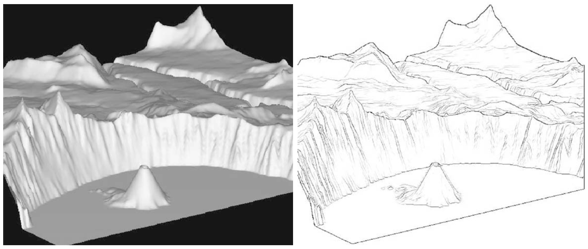

.small[_Lesage, Visvalingam, 2002_]

---

## Графический конвейер

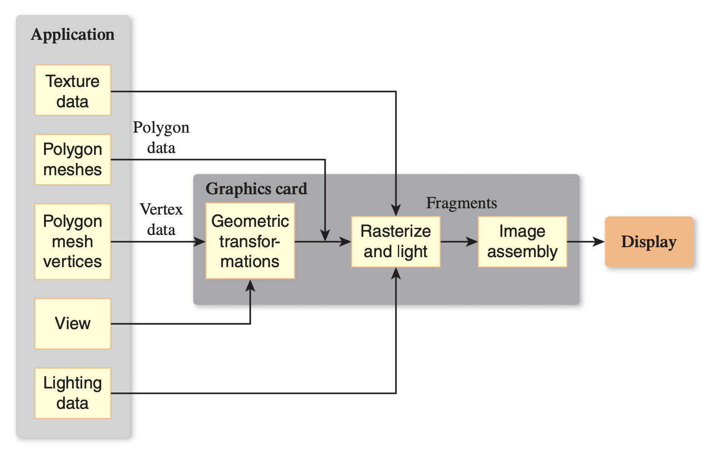

.small[_Hughes et al, 2013_]

---

## Графический конвейер


Взаимодействие с пользователем может оказывать влияние на последующее поведение графического приложения

---

## Графический конвейер 2D-приложения

.pull-left[
  
]

.pull-right[
__Графическая платформа__ отвечает за взаимодействие приложения и оборудования

__Модель приложения__ (application model) представляет визуализируемые данные

__Клиентская область__ (client area) определяет пространство, в котором приложение выполняет отрисовку.

__Порт просмотра__ (viewport) определяет часть клиентской области, где генератор сцены выполняет отрисовку модели
]

---

## Эволюция графической платформы

__1980-е — начало 1990-х__ _(Apple QuickDraw, Microsoft GDI)_: отрисовка пикселей на прямоугольной канве в целочисленных координатах. Отрисовка .red[_примитивов_]: геометрических форм или битмапов (пиксельных карт). 
  - Точка $(0,0)$ располагается в левом верхнем углу.
  - Каждый примитив заполняется путем вызова определенной функции (например, `FillRectangle`).
  - Размер объекта зависит от разрешения объекта. Более низкое разрешение (крупные пикселы) — больше размеры объектов.
  
__Середина 1990-х — н.вр.__ Переход к координатам с плавающей точкой позволил решить проблему зависимости размера изображения от системы координат.

---

## Непосредственный режим 

В .blue[__непосредственном режиме__] _(immediate mode)_ клиент через графическую платформу обращается непосредственно к выводящему устройству. 
- Запись примитивов, переданных приложением, не выполняется. 
- При смене сцены приложение должно перерисовать ее целиком. 


---

## Сохраненный режим 

В .red[__сохраненном режиме__] _(retained mode)_ графическая платформа хранит спецификацию сцены в виде специализированной базы данных, которая называется графом сцены _(scene graph)_. 
- Объекты могут добавляться в граф сцены последовательно.
- Каждое изменение графа приводит к перерисовке сцены

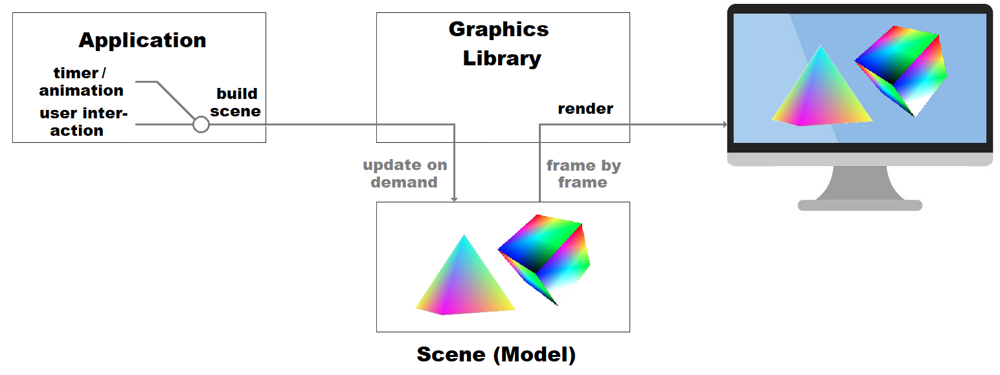

---

## Процедурный и декларативный подходы

.blue[__Процедурный код__] пишется на императивном языке программирования 
- Описывает _действия_
- Стандарт при взаимодействии с графической платформой 
- В геоинформационных пакетах применяется на низком уровне, невидимом для пользователя

.red[__Декларативные спецификации__] фиксируются на языке разметки
- Описывают _результаты_
- Вспомогательное средство в графических платформах
- В геоинформационных пакетах применяется на высоком уровне при описании стилей карт (CSS, LYR, QML, SLD, YSLD)

---

## Процедурный код

Классический низкоуровневый пример — отрисовка линии.

`draw_line(x0, y0, x1, y1)`


.blue[__Алгоритм Брэзенхема__]
.small[_Bresenham, J. E._ (1965). "Algorithm for computer control of a digital plotter" (PDF). __IBM Systems Journal__. 4 (1): 25–30. doi:10.1147/sj.41.0025.]

---

## Алгоритм Брезенхэма

Cистема экранных координат $XY$, где $X$ — столбец (увеличивается слева направо), $Y$ — строка (увеличивается сверху вниз)

- $(x_0, y_0)$ — начальная точка отрезка в экранных координатах
- $(x_1, y_1)$ — конечная точка отрезка в экранных координатах

Уравнение отрезка:
$$\frac{y - y_0}{y_1-y_0} = \frac{x - x_0}{x_1-x_0}$$
Выразив $y$, получаем:
$$y = \color{red}{\underbrace{\frac{y_1 - y_0}{x_1-x_0}}_{\textbf{d (уклон)}}} (x - x_0) + y_0$$
---

## Алгоритм Брезенхэма

_Стандартно_ рассматривается отрисовка линии, которая располагается в секторе `В-ЮВ`, т.е. идет относительно начальной точки вправо и полого вниз при соблюдении следующих условий:
- $x_0 \geq 0,~y_0 \geq 0$;
- $x_0 < x_1,~y_0 \leq y_1$;
- $x_1 - x_0 \geq y_1 - y_0$.


---

## Алгоритм Брезенхэма

Для сектора `В-ЮВ` алгоритм опирается на координаты $x$:

.pull-left[__Вычисляем заранее__:
- $dx = x_1 - x_0$.
- $dy = y_1 - y_0$.
- $\color{blue}{d = dy / dx}$;
- $\color{blue}{y = y_0}$;
- $e = 0$]

.pull-right[__Для $\color{blue}{x = x_0, ... x_1}$, выполняем__:
1. Рисуем пиксель $(x, y)$.
2. Обновляем ошибку $e = e + |d|$.
3. Если $e \geq 0.5$, то:
  - $\color{blue}{y = y + \texttt{sign}(dy)}$,
  - $e = e - 1$.]
  
Использование функции $\texttt{sign}$ позволяет применять алгоритм также и для сектора `В-СВ` (только $y$ будет уменьшаться).

Обозначим этот случай как `draw_line_byX(x0, y0, x1, y1)`

---

## Алгоритм Брезенхэма

.pull-left[_Альтернативно_ рассматривается отрисовка линии, которая располагается в секторе `Ю-ЮВ`, т.е. идет относительно начальной точки вправо и круто вниз при соблюдении следующих условий:
- $x_0 \geq 0,~y_0 \geq 0$;
- $x_0 \leq x_1,~y_0 < y_1$;
- $x_1 - x_0 < y_1 - y_0$.]

.pull-right[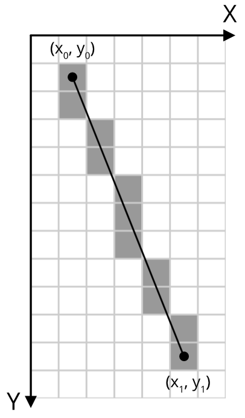]

---

## Алгоритм Брезенхэма

Для сектора `Ю-ЮВ` алгоритм опирается на координаты $y$:

.pull-left[__Вычисляем заранее__:
- $dx = x_1 - x_0$.
- $dy = y_1 - y_0$.
- $\color{red}{d = dx / dy}$;
- $\color{red}{x = x_0}$;
- $e = 0$]

.pull-right[__Для $\color{red}{y = y_0, ... y_1}$, выполняем__:
1. Рисуем пиксель $(x, y)$.
2. Обновляем ошибку $e = e + |d|$.
3. Если $e \geq 0.5$, то:
  - $\color{red}{x = x + \texttt{sign}(dx)}$,
  - $e = e - 1$.]
  
Использование функции $\texttt{sign}$ позволяет применять алгоритм также и для сектора `Ю-ЮЗ` (только $x$ будет уменьшаться).

Обозначим этот случай как `draw_line_byY(x0, y0, x1, y1)`

---

## Алгоритм Брезенхэма

Для оставшихся направлений построение линий реализуется путем перестановки местами начальной и конечной точки. Код результирующей функции на языке __Python__:
```{python, eval=FALSE}
def plot_line(x0, y0, x1, y1):
    if abs(y1 - y0) < abs(x1 - x0): # пологая линия
        if x0 > x1:
            plot_line_byX(x1, y1, x0, y0)
        else:
            plot_line_byX(x0, y0, x1, y1)
    else:
        if y0 > y1:                 # крутая линия
            plot_line_byY(x1, y1, x0, y0)
        else:
            plot_line_byY(x0, y0, x1, y1)
```

где `abs()` — функция вычисления модуля.

---

## Заливка полигона


---

## Заливка полигона

.blue[__Алгоритм сканирующей линии:__]

Для каждого $y_k = y_{min},...,y_{max}$ необходимо получить упорядоченное по возрастанию множество $X = \{x_1, x_2, ..., x_n\}$ абсцисс точек его пересечения с исходными линиями:
1. Для каждой линии $l_j, j = 1,...,N$:
  - вычислить флаг пересечения $f: y^j_0 < y_k \neq y^j_1 < y_k$;
  - если $f = \texttt{TRUE}$, то
      - вычислить $x^j = x^j_0 + (x^j_1 - x^j_0)\frac{y_k - y^j_0}{y^j_1 - y^j_0}$;
      - добавить $x^j$ в множество $X$.
2. Если $X$ не пусто, то упорядочить его по возрастанию и выполнить закрашивание между его элементами в порядке:

$$\lceil x_1 \rceil \to \lfloor x_2 \rfloor,~\lceil x_3 \rceil \to \lfloor x_4 \rfloor,~...~,~\lceil x_{n-1} \rceil \to \lfloor x_n \rfloor$$

---

## Передискретизация (resampling)

Передискретизация необходима при визуализации растрового изображения на растровом экране. Как правило, разрешение этих растров не совпадает.


---

## Метод ближайшего соседа

Используется значение ближайшего пикселя:


---

## Метод билинейной интерполяции

Восстанавливается поверхность в ячейке из 4 узлов:


---

## Метод билинейной интерполяции

.left-40[
  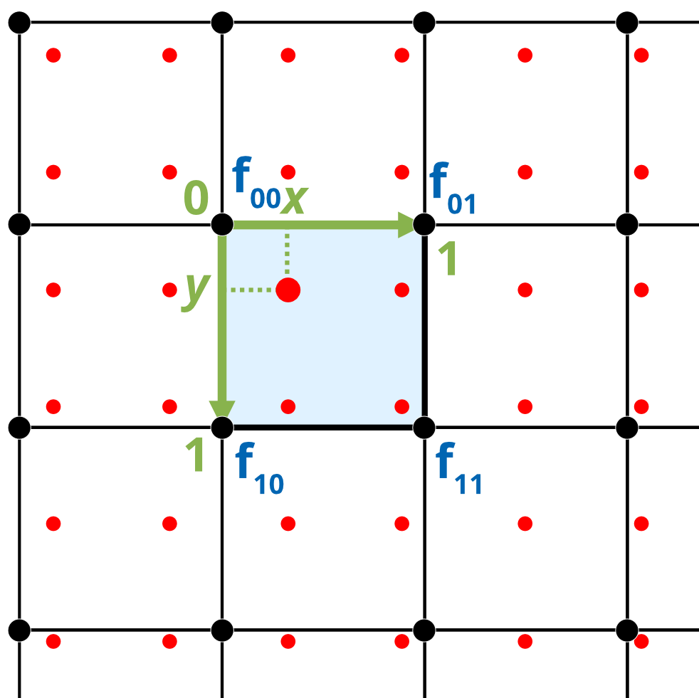
]

.right-60[
Коэффициенты определяются по 4 точкам:
$$\begin{cases}
a_{00} = f_{00},\\
a_{10} = f_{10} - f_{00},\\
a_{01} = f_{01} - f_{00},\\
a_{01} = f_{00} + f_{11} - f_{10} - f_{01}.
\end{cases}$$

$$f(x, y) = a_{00} + a_{10}x + a_{01}y + a_{11}xy$$]


Координаты $x$ и $y$ меняются в диапазоне от $0$ до $1$ в пределах ячейки.

---

## Метод бикубической интерполяции

Восстанавливается поверхность в 9 ячейках, окружающих узел:


---

## Метод бикубической интерполяции

.left-40[

]

.right-60[
Коэффициенты определяются по 16 точкам:

$$\begin{cases}
f(0,0) = a_{00},\\
f(1,0) = a_{00} + a_{10} + a_{20} + a_{30},\\
f(0,1) = a_{00} + a_{01} + a_{02} + a_{03},\\
f(1,1) = \sum_{i=0}^3 \sum_{j=0}^3 a_{ij},\\
\dots
\end{cases}$$

$$f(x, y) = \sum_{i=0}^3 \sum_{j=0}^3 a_{ij} x^i y^j$$ 
]

Координаты $x$ и $y$ меняются в диапазоне от $0$ до $1$ в пределах окрестности $3 \times 3$ ячеек.

---

## Передискретизация и фильтрация

.pull-left[
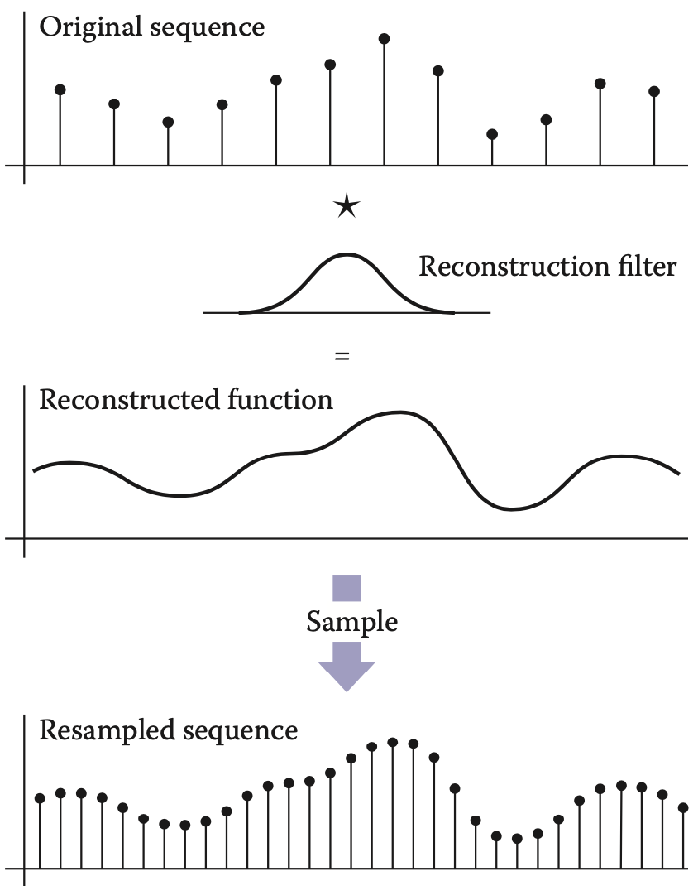
.small[_Marschner et al., 2016_]
]
.pull-right[
Передискретизацию можно также рассматривать как двухстадийный процесс:
- Построение гладкой непрерывной функции путем применения реконструкционного фильтра

- Выборка (семплирование) значений функции в локациях, определенных узлами новой сетки
]

---

## Передискретизация и фильтрация

Псевдокод одномерной передискретизации:

```{python, eval = FALSE}
fun resample(sequence a, float x0, float dx, int n, filter f)
  b = list(length = n)
  for i = 0 to n-1 do
    b[i] = reconstruct(a, f, x0 + i * dx)
  return b
```

Параметр `x0` отвечает за расположение первого элемента выборки в системе координат исходной последовательности.

Например, если этот элемент расположен посередине между 0-м и 1-м элементом исходной последовательности, то `x0 = 0.5`

---

## Дискретно-непрерывная свёртка

Восстановление непрерывной поверхности происходит путем взвешенного осреднения исходных значений. Веса определяются свёрточным ядром:
.left-60[
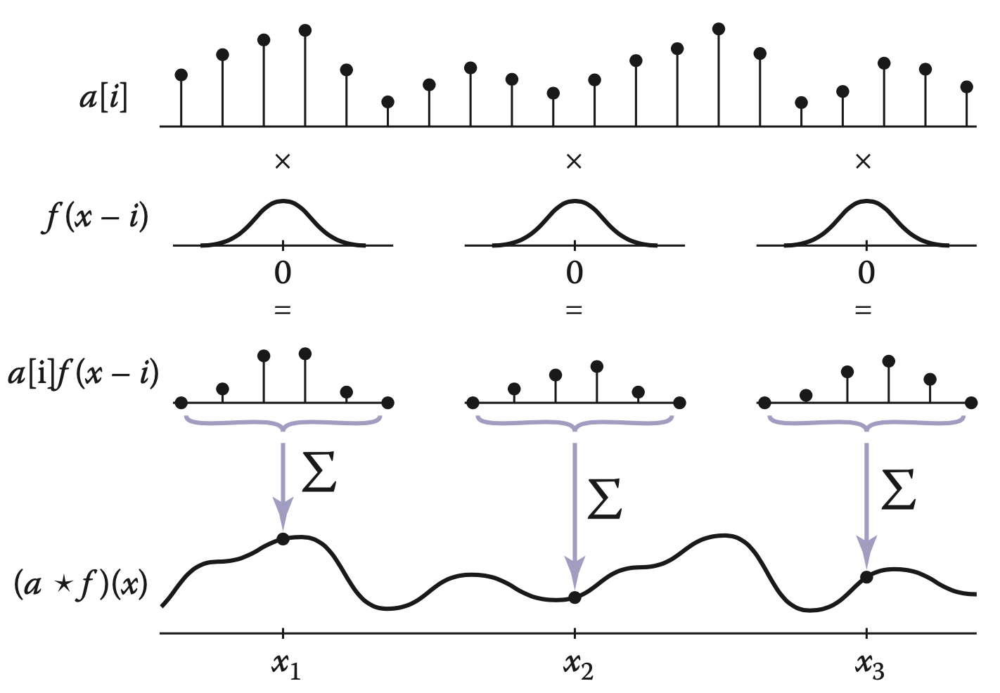

.small[_Marschner et al., 2016_]
]
.right-40[
Свертка есть результат произведения функций:
$$(a \star f)(x) = \sum_i a[i] f(x-i)$$

Для ядра ограниченного радиуса $r$:
$$(a \star f)(x) = \sum_{i = \lceil x-r\rceil}^{\lfloor x+r \rfloor} a[i] f(x-i)$$
]

---

## Дискретно-непрерывная свёртка

.left-60[
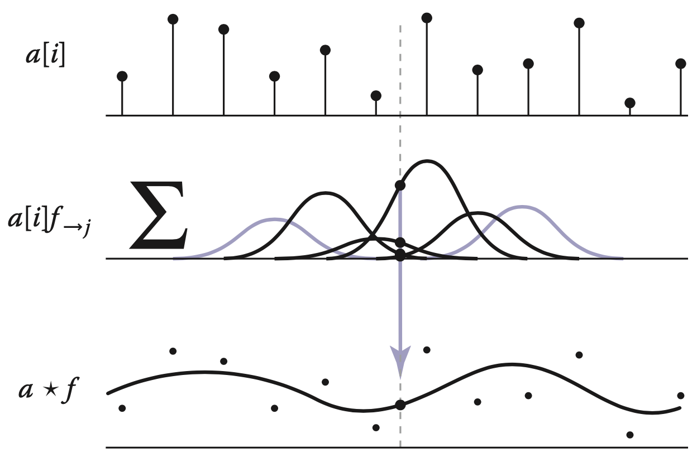

.small[_Marschner et al., 2016_]
]
.right-40[
Восстановленную функцию можно получить путем суммирования произведений фильтра и исходного значения в точках $i$:
$$(a \star f) = \sum_i a[i] f_{\to i}$$
]

---

## Дискретно-непрерывная свёртка

Псевдокод:

```{python, eval = F}
fun reconstruct(sequence a, filter f , real x)
  s=0
  r = f.radius
  for i = ⌈x − r⌉ to ⌊x + r⌋ do
    s = s + a[i]f (x − i) 
  return s
```

---

## Популярные фильтры

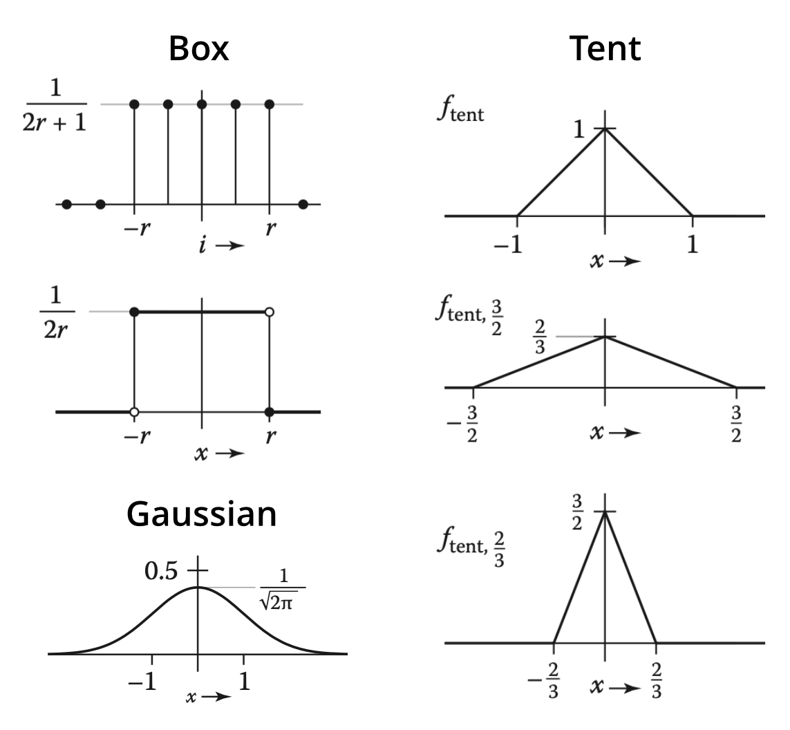

---

## Передискретизация и фильтрация

Проблема передискретизации при даунсемплинге (понижении разрешения) заключается в появлении артефактов таких как муар (слева) и зубчатость (справа):

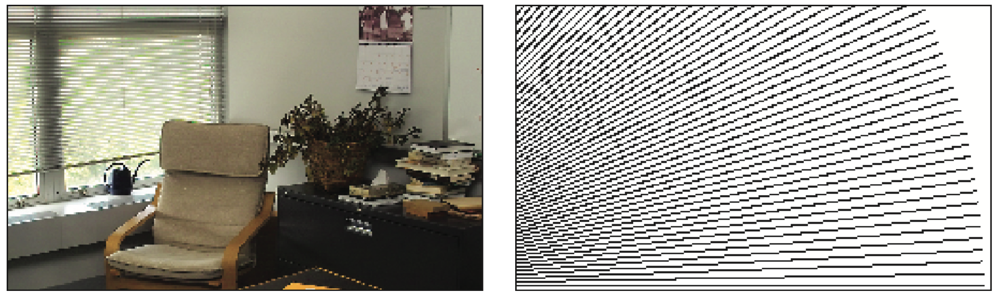
.small[_Marschner et al., 2016_]

Поэтому при понижении разрешения помимо реконструкционного фильтра необходимо использовать также сглаживающий.

---

## Передискретизационный фильтр

Поскольку свёрточные фильтры можно перемножать, для комбинирования реконструкции и сглаживания достаточно провести фильтрацию один раз (диагональная стрелка):

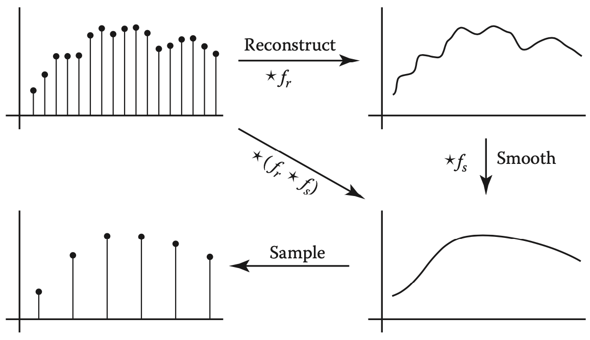

.small[_Marschner et al., 2016_]

---

## Передискретизация и фильтрация

Прямоугольный домен изображения размером $n_x \times n_y$:

$$R = [-0.5, n_x - 0.5] \times [-0.5, n_y - 0.5]$$
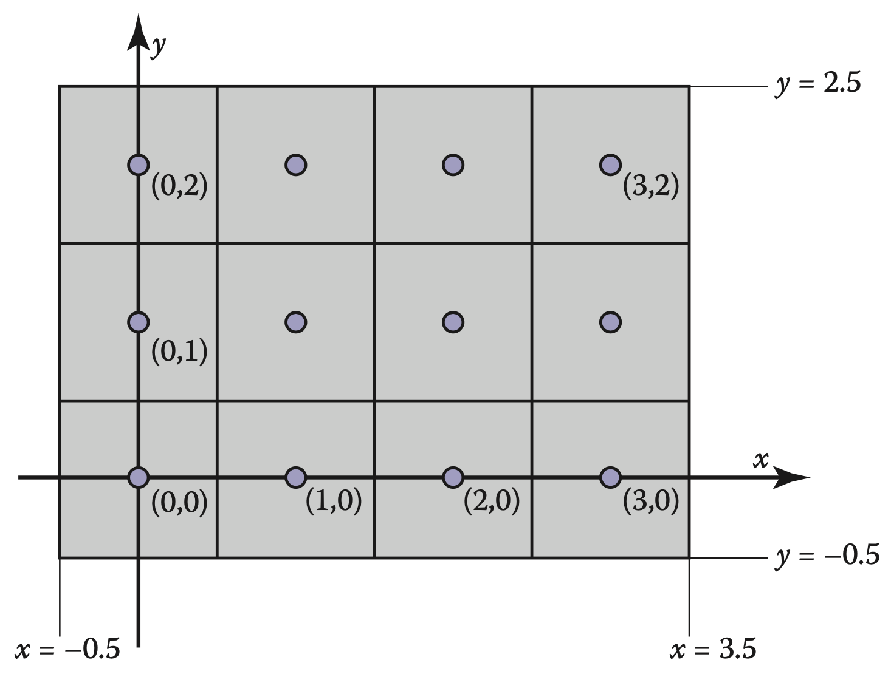

.small[_Marschner et al., 2016_]

---

## Передискретизация и фильтрация

Псевдокод одномерной сглаживающей передискретизации:

```{python, eval = FALSE}
fun resample(sequence a, float xmin, float xmax, int n, filter f)
  b = list(length = n)
  r = f.radius
  dx = (xmax - xmin)/n
  x0 = xmin + dx/2
  for i = 0 to n-1 do
    s = 0
    x = x0 + i * dx
    for j = ceil(x-r) to floor(x+r) do
      s = s + a[j] * f(x - j)
    b[i] = s
  return b
```

Параметры `xmin` и `xmax` обозначают минимальную и максимальную растровую координату по измерению `X`. Для полного изображения `xmin = -0.5`, `xmax = nx - 0.5`.

---

## Фильтрация на границе растра

Если фильтр выходит за границу растра, возможно три варианта:

- Не обрабатывать такие пикселы. В этом случае они будут заполнены нулями.

- Обрезать все индексы до минимально и максимально возможной координаты. В этом случае при индексации $a[-1]$ будет возвращаться $a[-0]$, а при индексации $a[|a|]$ будет возвращаться $a[|a|-1]$.

- Модифицировать фильтра для граничных ячеек. Например, заменить бикубическую интерполяцию на билинейную. Если используется сверточный фильтр, то уменьшение числа его элементов требует ренормализации значений (разделить на сумму элементов, перекрывающих фильтруемый растр).

---

## Метод бикубической интерполяции

Keys (1981) показал, что бикубическую реконструкцию можно реализовать путем свёртки с использованием следующего фильтра:

$$W(x) = \begin{cases}
 (a+2)|x|^3-(a+3)|x|^2+1 & \text{для } |x| \leq 1, \\
 a|x|^3-5a|x|^2+8a|x|-4a & \text{для } 1 < |x| < 2, \\
 0                       & \text{иначе},
\end{cases},$$

где $a = -0.5$ или $a = -0.75$. 

_R. Keys._ Cubic convolution interpolation for digital image processing // __IEEE Transactions on Acoustics, Speech, and Signal Processing__ — 1981. — Vol. 29, no. 6. — P. 1153—1160. — doi:10.1109/TASSP.1981.1163711

---

## Сглаживание (antialiasing)

При крупном размере пиксела выводящего устройства ступенчатость линий и границ полигонов становится заметной. 

Для устранения эффекта ступенчатости используется __сглаживание__ (_antialiasing_).


Вверху — со сглаживанием, внизу — без (.small[_Marschner et al., 2016_])

---

## Сглаживание (antialiasing)

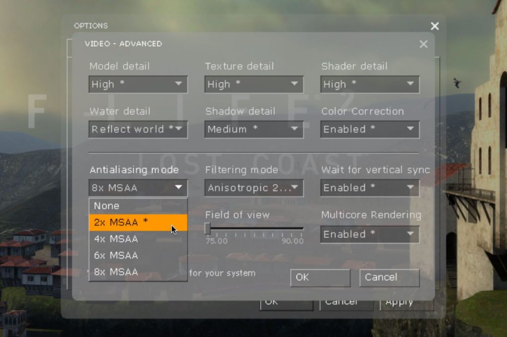

.small[https://www.neogamr.net/what-is-anti-aliasing/]

---

## Суперсемплинг (antialiasing)

Пусть результирующее растровое изображение $R$ имеет размеры $m \times n$.

1. Создается буферное изображение $R_b$ размером $km \times kn$, где $k \in \mathbb{N^*}$ — коэффициент сглаживания (положительное натуральное число).
2. Объекты отрисовываются в $R_b$.
3. Производится передискретизация $R_b \to R$ с использованием блочной фильтрации (_box filter_). Значение результирующего пиксела $R[i, j]$ равняется среднему арифметическому значений $R_b$, попадающих в его пределы:

$$R[i, j] = \sum_{l = 1}^L s(R_b) / L,$$

где $s(R_b)$ — выборочное значение (сэмпл), взятое с $R_b$.

---

## Стратегии семплирования 

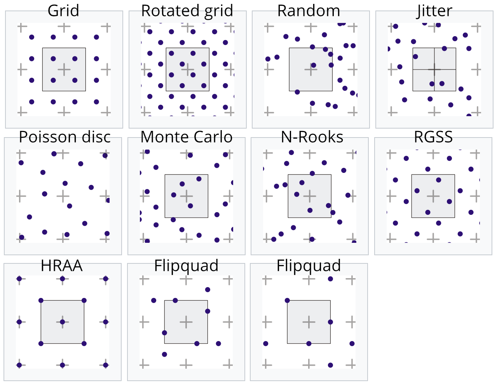
.small[https://en.wikipedia.org/wiki/Supersampling]

---

## Аффинное преобразование

В системах двумерной визуализации данных фундаментальную роль играют _аффинные преобразования_.

__Аффинное преобразование__ $f\colon\mathbb{R}^{n}\to \mathbb{R}^{n}$ есть преобразование вида: 

$$f(x) = M \cdot x + v,$$

где $M$ — _обратимая матрица_ (квадратная матрица, определитель которой отличен от нуля) и $v\in \mathbb{R}^{n}$.

С помощью аффинных преобразований осуществляется __навигация__ по карте: _масштабирование, перемещение, поворот изображения_. 

Частные случаи этих операций могут быть связаны с центрированием относительно объекта, а также "вписыванием" объекта или множества объектов в пределы экрана.
