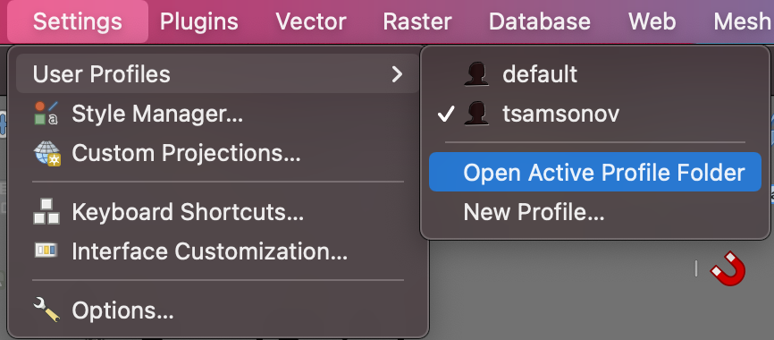
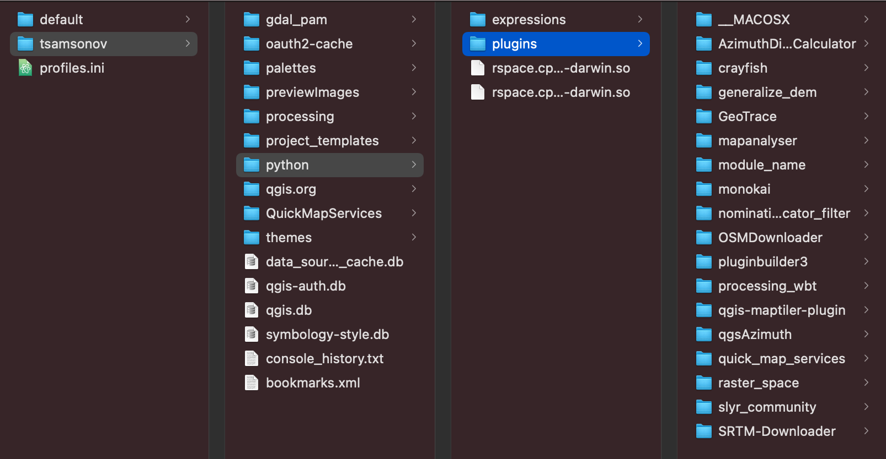
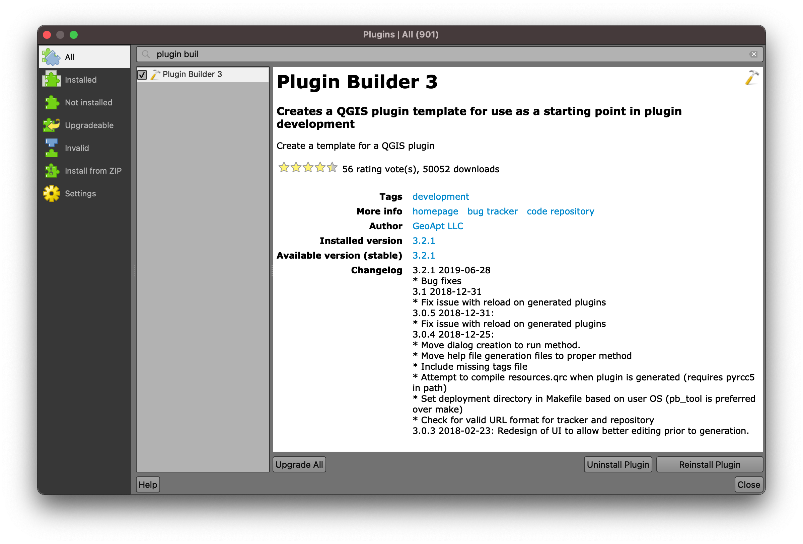
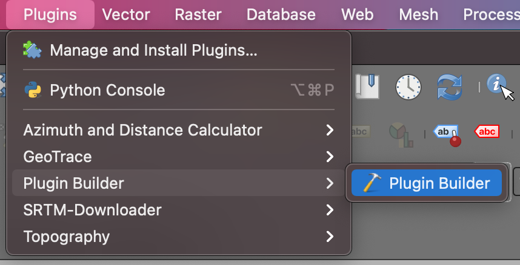
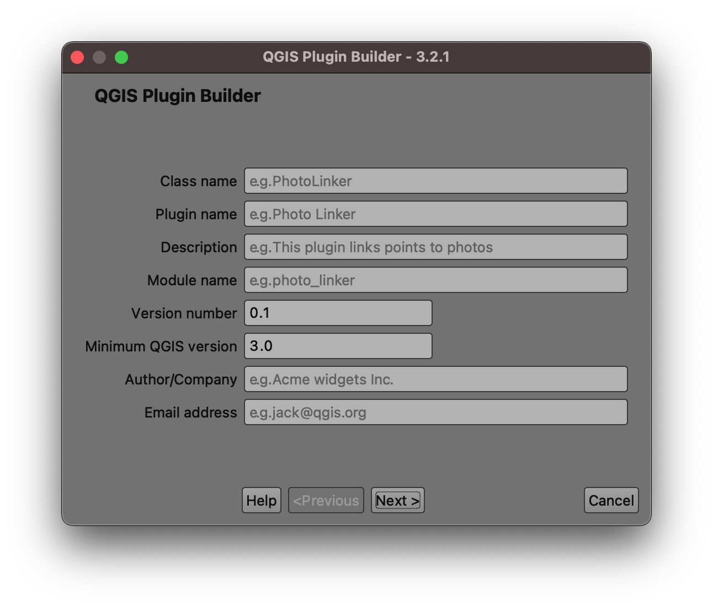

## Плагин для QGIS

Плагины располагаются в рабочей папке пользователя:



---

## Плагин для QGIS

Все установленные (в т.ч. ваши) плагины располагаются в папке python:



---

## Структура плагина

```
PYTHON_PLUGINS_PATH/
  MyPlugin/
    __init__.py    --> *точка входа в плагин*
    mainPlugin.py  --> *рабочий код плагина*
    metadata.txt   --> *метаданные*
    resources.qrc  --> *описание ресурсов, используемых интерфейсом*
    resources.py   --> *то же самое, но в виде кода на Python*
    form.ui        --> *описание графического интерфейса Qt Designer*
    form.py        --> *то же самое, но в виде кода на Python*
```

---

## Оптимальная стартовая точка

Plugin Builder



---

## Plugin Builder



---

## Plugin Builder

